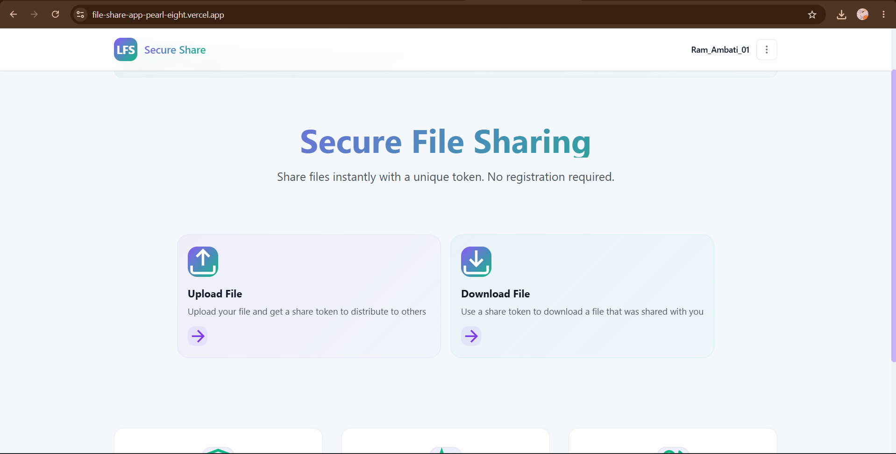
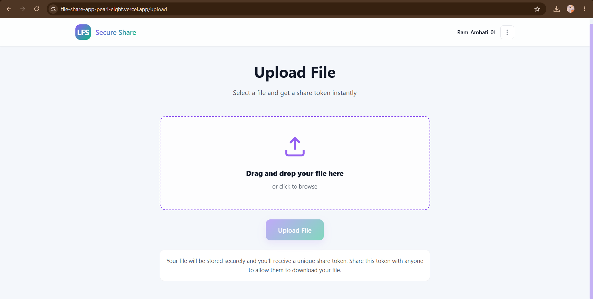
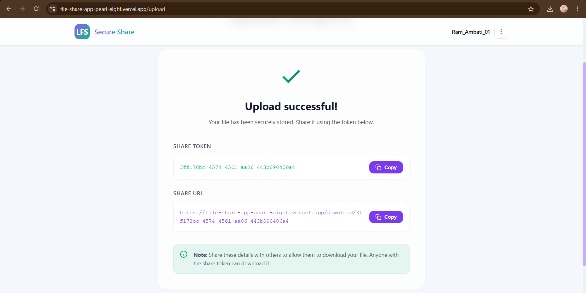
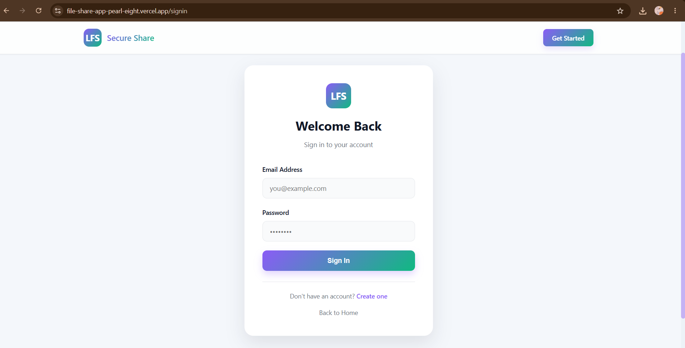

# 🔐 LFS-App - Secure Token-Based File Sharing

<p align="center">
  
  
  
  
  
  
  
  
</p>

<p align="center">
  <strong>LFS-App</strong> is a full-stack, secure file sharing platform that allows users to instantly upload files, generate unique secure sharing tokens, and distribute them for direct downloads. Supports quick guest uploads as well as registered user accounts with expanded storage limits.
</p>

---

<p align="center">
  <a href="https://file-share-app-pearl-eight.vercel.app/" target="_blank">
    
  </a>
</p>

---

## 📸 Screenshots

<p align="center">
  <strong>Welcome / Home Page</strong><br/>
  
  <br/><br/><br/>
  
  <strong>File Upload Dashboard</strong><br/>
  
  <br/><br/><br/>
  
  <strong>File Download Page</strong><br/>
  
  <br/><br/><br/>
  
  <strong>User Sign In / Register</strong><br/>
  
</p>

---

## ✨ Features

- 📂 **Dual File-Sharing Flows**:
  - **Guests**: Share files instantly without an account.
  - **Registered Users**: Create an account to unlock higher storage limits and track uploaded files.
- ⚡ **Dynamic Limit System**: Configurable upload file size limits, maximum concurrent uploads, and total storage quotas per user type.
- ☁️ **Hybrid Storage Providers**: Supports both local file system storage (development) and Cloudinary cloud storage integration (production).
- 🔑 **Token-Based Sharing**: Secure, UUID-based file identification with direct token queries and one-click downloading.
- 📊 **Download Logging**: Automatically records IP addresses and user agents for downloads to track file usage.
- 🐳 **Dockerized Backend**: Multi-stage production-ready Docker builds with dedicated spring non-root user execution.
- 🔒 **Security Hardening**: Secure CORS settings, Content Security Policy, frame options, and HSTS headers.

---

## 🧱 System Architecture

```text
       ┌────────────────────────┐
       │   React Frontend       │ (Hosted on Vercel)
       │   (Single Page App)    │
       └───────────┬────────────┘
                   │
                   │  HTTPS + JWT Token
                   │  (Cookie / Authorization Header)
                   ▼
       ┌────────────────────────┐
       │  Spring Boot REST API  │ (Hosted on Render - Docker Container)
       │  (Security & Limits)   │
       └─────┬────────────┬─────┘
             │            │
             │ SQL        │ Files (Multipart Upload)
             ▼            ▼
 ┌───────────────┐   ┌───────────────────────────┐
 │  Supabase DB  │   │ Storage: Local uploads/   │
 │ (PostgreSQL)  │   │    or Cloudinary Bucket   │
 └───────────────┘   └───────────────────────────┘
```

---

## 🔐 Security & Session Architecture

### JWT Session Authentication
The application supports a secure user login and registration system powered by **JSON Web Tokens (JWT)**. 

### Cross-Domain Cookie Fallback (Important)
Because the frontend is hosted on Vercel (`vercel.app`) and the backend is on Render (`onrender.com`), browsers identify this as a cross-site connection and block cookies by default (due to strict SameSite/Secure browser policies).

To bypass this restriction seamlessly:
1. **Token Persistence**: When a user logs in or registers, the frontend extracts the JWT token from the response body and saves it locally in `localStorage` under `lfs_jwt_token`.
2. **Authorization Headers**: All outgoing requests (checking sessions, limits, uploading, and downloading) automatically append the `Authorization: Bearer <token>` header if present.
3. **Session Validation**: The backend's `JwtAuthenticationFilter` validates this bearer header first, ensuring authentication succeeds even when cookies are entirely blocked.

---

## ⚙️ Local Setup

### 1. Prerequisite Environments
- **Node.js** (v18 or higher) & **NPM**
- **Java Development Kit (JDK 17)** or Docker

### 2. Configure Environment Variables
Create a `.env` file inside both `/frontend` and `/backend` directories:

**Frontend (`/frontend/.env`):**
```env
VITE_API_BASE_URL=http://localhost:8080/api
```

**Backend (`/backend/.env`):**
```env
SPRING_DATASOURCE_URL=jdbc:postgresql://localhost:5432/lfs_app
SPRING_DATASOURCE_USERNAME=postgres
SPRING_DATASOURCE_PASSWORD=your_local_password
JWT_SECRET=LFS_APP_DEV_SECRET_CHANGE_BEFORE_PRODUCTION
APP_ENVIRONMENT=development
FRONTEND_URL=http://localhost:5173
```

### 3. Launching Locally

#### A. Standard Running (Multi-Terminal)
**Start Backend:**
```bash
cd backend
./mvnw spring-boot:run
```
**Start Frontend:**
```bash
cd frontend
npm install
npm run dev
```

#### B. Docker Running (Containerized Backend)
To compile the Spring Boot app and run it inside a Docker container:
```bash
# Build the Docker image
docker build -t lfs-backend backend/

# Run the container (injecting environment variables)
docker run -p 8080:8080 --env-file backend/.env lfs-backend
```

---

## 🚀 Production Deployment

### Backend (Render Deployment)
1. Set up a new **Web Service** on Render and connect it to your GitHub Repository.
2. Set the **Root Directory** to `backend`.
3. Set the **Environment/Runtime** to `Docker` (Render will automatically detect and build using `backend/Dockerfile`).
4. Configure the following environment variables in your Render Dashboard:
   - `SPRING_DATASOURCE_URL` = (Your PostgreSQL database URL, e.g. Supabase IPv4 Pooler URL)
   - `SPRING_DATASOURCE_USERNAME` = (Database Username)
   - `SPRING_DATASOURCE_PASSWORD` = (Database Password)
   - `JWT_SECRET` = (Generate a secure 256-bit hex secret key)
   - `APP_ENVIRONMENT` = `production`
   - `FRONTEND_URL` = `https://your-vercel-frontend-domain.vercel.app`

### Frontend (Vercel Deployment)
1. Add a new project on Vercel and connect your Repository.
2. Select **Root Directory** as `frontend`.
3. Set the build framework to **Vite** (Vercel detects this by default).
4. Configure Environment Variables:
   - `VITE_API_BASE_URL` = `https://your-render-backend-url.onrender.com/api`
5. Vercel utilizes [vercel.json](file:///c:/Users/ambat/Desktop/LFS%20App/frontend/vercel.json) to rewrite all routes to `/index.html`, eliminating `404 NOT_FOUND` errors on page refresh.

---

## 🚀 Milestones & Future Goals

### ✅ What We've Accomplished
- **Environment-Driven Configuration**: Moved database credentials, JWT secrets, and CORS domains out of the codebase and into secure environment variables.
- **Dockerization**: Created a secure, multi-stage production Docker configuration for the Spring Boot backend, running under a dedicated non-root user.
- **Vercel Routing Rewrite**: Added a `vercel.json` rewrite rule to redirect all paths back to `/index.html`, eliminating the frustrating `404 NOT_FOUND` error on page refresh.
- **JWT Header Fallback**: Implemented automatic `Authorization: Bearer` headers in the frontend API client. This bypasses the third-party cookie restrictions enforced by modern browsers in cross-domain environments.
- **Improved UX (URL Pasting)**: Added automated token extraction in the download page, allowing users to paste either the raw token or the full download URL.
- **Clean Compiler Audits**: Resolved java URL constructor deprecation warnings and cleaned up all unused imports and autowired repository references.

### 🎯 What is Next (Future Scope)
- 🔒 **Password-Protected Downloads**: Allow uploaders to secure files with custom passwords.
- ⏱️ **Auto-Expiry Timers**: Implement background tasks to automatically delete files after a selected period (e.g. 24 hours, 7 days).
- 📈 **Download Limits**: Option to limit the number of times a file can be downloaded before expiring.
- 📦 **AWS S3 / Cloud Storage Integration**: Expand beyond local disk and Cloudinary to support direct streaming to Amazon S3 bucket storage.
- 📊 **User Dashboard & File Analytics**: Provide account holders with simple charts tracking download activity, download counts, and total storage usage.

---

## 👨‍💻 Author

**Ram Ambati**
- GitHub: [@Ram-ambati](https://github.com/Ram-ambati)
- Engineering Student & Full-Stack Developer
