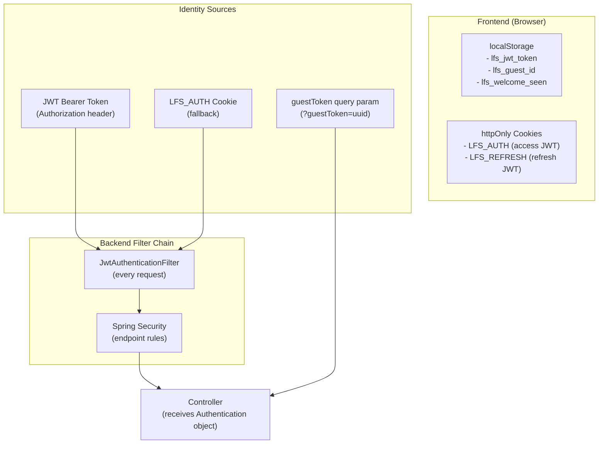
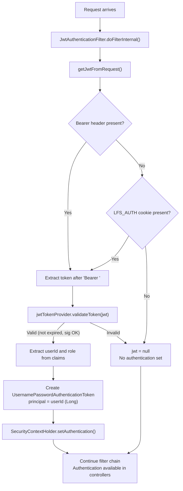
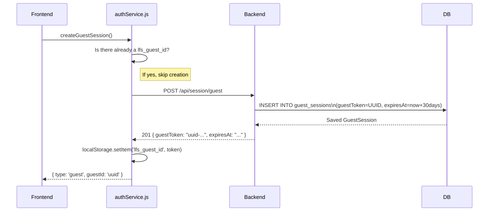

# LFS App — Authentication & Security

> **Audience:** Developers who need to understand the security model, add authentication features, or audit the security posture  
> **Key concept:** This app has TWO identity systems running in parallel — JWTs for registered users and UUID tokens for guests.

---

## 1. Authentication Architecture Overview



The backend identity resolution priority:
1. **JWT in `Authorization: Bearer` header** → sets Spring `Authentication` object
2. **JWT in `LFS_AUTH` httpOnly cookie** → sets Spring `Authentication` object (fallback)
3. **`?guestToken=` query parameter** → handled manually in FileController/LimitsController
4. **Nothing** → `Authentication` is null; may be 401 depending on endpoint

---

## 2. JWT Flow — Registered Users

### 2a. Token Generation at Login

```mermaid
sequenceDiagram
    participant Client
    participant AuthController
    participant AuthService
    participant JwtTokenProvider
    participant DB

    Client->>AuthController: POST /api/auth/login { email, password }
    AuthController->>AuthService: login(request)
    AuthService->>DB: SELECT * FROM app_users WHERE email = ?
    DB-->>AuthService: User entity
    AuthService->>AuthService: passwordEncoder.matches(input, hash)
    AuthService->>JwtTokenProvider: generateAccessToken(user)
    JwtTokenProvider-->>AuthService: "eyJhbGci..." (JWT, 1 hour expiry)
    AuthService->>JwtTokenProvider: generateRefreshToken(user)
    JwtTokenProvider-->>AuthService: "eyJhbGci..." (JWT, 30 day expiry)
    AuthService-->>AuthController: AuthResponse { user, accessToken, refreshToken }
    AuthController->>AuthController: createAccessTokenCookie(accessToken)
    AuthController->>AuthController: createRefreshTokenCookie(refreshToken)
    AuthController-->>Client: 200 OK\nbody: { id, username, email, role, token }\nSet-Cookie: LFS_AUTH=...; LFS_REFRESH=...
    Client->>Client: localStorage.setItem('lfs_jwt_token', data.token)
```

### 2b. JWT Structure

The JWT payload (claims):
```json
{
  "sub": "42",              // User ID (used to look up user)
  "username": "ram",        // Display name
  "email": "ram@example.com",
  "role": "ROLE_USER",      // Used for authorization
  "iat": 1718800000,        // Issued at (Unix timestamp)
  "exp": 1718803600         // Expires at (1 hour later)
}
```

The JWT is signed with `HS256` (HMAC-SHA256) using the `JWT_SECRET` environment variable (a 256-bit hex key).

### 2c. Token Validation on Each Request



### 2d. Accessing User Identity in Controllers

```java
// In any controller that receives Authentication
public ResponseEntity<?> uploadFile(
    @RequestParam("file") MultipartFile file,
    Authentication authentication,  // Injected by Spring
    ...
) {
    if (authentication != null 
        && authentication.isAuthenticated() 
        && authentication.getPrincipal() instanceof Long) {
        
        Long userId = (Long) authentication.getPrincipal();  // This is the user ID
        User user = authService.getUserById(userId);
        // ... proceed with user upload
    }
}
```

The principal is set to `userId` (a `Long`) in the filter — not the username or User object. This is a deliberate design choice to avoid a DB call in the filter itself.

---

## 3. Guest Session Flow

Guest sessions use a completely different mechanism — no JWT, no database-based session:

### 3a. Guest Session Creation



### 3b. Guest Session Validation

On every request that uses a guest token:

```java
// FileController.java or LimitsController.java
if (guestToken != null && !guestToken.isEmpty()) {
    if (!authService.isValidGuestSession(guestToken)) {
        return ResponseEntity.status(401).body(new ErrorResponse(401, "Invalid or expired guest session"));
    }
    GuestSession guestSession = authService.getGuestSession(guestToken);
    // ... proceed
}
```

```java
// AuthService.java
public boolean isValidGuestSession(String guestToken) {
    GuestSession session = guestSessionRepository.findByGuestToken(guestToken).orElse(null);
    return session != null && !session.isExpired();
}
```

### 3c. Guest Session Validation Endpoint

The frontend validates the stored guest token on app load:
```
GET /api/session/validate?guestToken={uuid}
→ { "valid": true } or { "valid": false }
```

This is a public endpoint — no auth required. If the session is invalid (expired or not found), the frontend clears localStorage and creates a new one.

---

## 4. Cookie Architecture

Two httpOnly cookies are set on login and registration:

| Cookie Name | Value | Max Age | Purpose |
|---|---|---|---|
| `LFS_AUTH` | Access JWT | 3600s (1 hour) | Short-lived auth token for API requests |
| `LFS_REFRESH` | Refresh JWT | 2592000s (30 days) | Long-lived token (refresh flow not yet implemented) |

**Cookie Attributes by Environment:**

| Attribute | Development | Production |
|---|---|---|
| `HttpOnly` | ✅ | ✅ |
| `Secure` | ❌ (allows HTTP) | ✅ (HTTPS only) |
| `SameSite` | (default, usually Lax) | `None` (cross-domain) |
| `Path` | `/` | `/` |

> **Why `SameSite=None` in production?** The frontend (Vercel) and backend (Render) are on different domains. By default, modern browsers block cookies from being sent cross-domain. `SameSite=None; Secure` allows the `LFS_AUTH` cookie to flow from the browser to `lfs-app.onrender.com` even when the page is on `lfs-app.vercel.app`.

---

## 5. Password Security

Passwords use **BCrypt** with Spring Security's default strength (10 rounds):

```java
// SecurityConfig.java
@Bean
public PasswordEncoder passwordEncoder() {
    return new BCryptPasswordEncoder();
}
```

```java
// AuthService.java - storing password
user.setPasswordHash(passwordEncoder.encode(request.getPassword()));

// AuthService.java - verifying password
if (!passwordEncoder.matches(request.getPassword(), user.getPasswordHash())) {
    throw new IllegalArgumentException("Invalid email or password");
}
```

BCrypt is a one-way adaptive hash function. Properties:
- Same password hashes to a different string each time (random salt)
- Cannot be reversed to find the original password
- Deliberately slow (10 rounds ≈ ~100ms per check) to make brute-force attacks impractical

---

## 6. CORS Configuration

The backend allows cross-origin requests from specific origins:

```java
// SecurityConfig.java
List<String> allowedOrigins = Arrays.asList(
    frontendUrl,              // env: FRONTEND_URL (production Vercel URL)
    "http://localhost:5173",  // Vite dev server
    "http://localhost:3000",  // Alternative frontend port
    "http://localhost:8080"   // Backend localhost (for testing)
);

configuration.setAllowCredentials(true);  // Required for cookies
configuration.setAllowedHeaders(Arrays.asList("*"));  // All headers allowed
configuration.setAllowedMethods(Arrays.asList("GET", "POST", "PUT", "DELETE", "OPTIONS", "PATCH"));
```

> **Why `allowCredentials(true)`?** This is required for the browser to send the `LFS_AUTH` cookie in cross-origin requests. Without it, even if the backend sets the cookie, the browser won't include it in subsequent requests.

> **Why a specific list instead of `"*"` for origins?** When `allowCredentials(true)` is set, `"*"` is not allowed by the CORS spec for security reasons. You must list explicit origins.

---

## 7. HTTP Security Headers

The backend adds security headers to every response:

```java
// SecurityConfig.java
http.headers(headers -> {
    headers.contentSecurityPolicy(csp -> csp.policyDirectives(
        "default-src 'self' https:; " +
        "img-src 'self' data: https://res.cloudinary.com; " +  // Cloudinary images allowed
        "script-src 'self' 'unsafe-inline' https:; " +
        "object-src 'none';"
    ));
    headers.frameOptions(frame -> frame.sameOrigin());        // X-Frame-Options: SAMEORIGIN
    headers.httpStrictTransportSecurity(hsts ->               // HSTS: 1 year
        hsts.includeSubDomains(true).maxAgeInSeconds(31536000)
    );
    headers.contentTypeOptions(cto -> {});                    // X-Content-Type-Options: nosniff
});
```

| Header | Value | Protection |
|---|---|---|
| `Content-Security-Policy` | (see above) | Prevents XSS, injection |
| `X-Frame-Options` | `SAMEORIGIN` | Prevents clickjacking |
| `Strict-Transport-Security` | `max-age=31536000; includeSubDomains` | Forces HTTPS |
| `X-Content-Type-Options` | `nosniff` | Prevents MIME type sniffing |

---

## 8. Access Control Rules Summary

| Endpoint | Method | Auth Required | Notes |
|---|---|---|---|
| `/api/auth/register` | POST | None | Public sign-up |
| `/api/auth/login` | POST | None | Public login |
| `/api/auth/logout` | POST | JWT | Clears cookies |
| `/api/auth/me` | GET | JWT | Returns user profile |
| `/api/auth/verify` | GET | JWT | Validates token |
| `/api/session/guest` | POST | None | Creates guest session |
| `/api/session/validate` | GET | None | Validates guest token |
| `/api/session/current` | GET | None | Gets guest session info |
| `/api/limits/current` | GET | JWT or guestToken | Returns limits for current user |
| `/api/files/upload` | POST | JWT or guestToken | Uploads file |
| `/api/files/info/{token}` | GET | None | File metadata (public) |
| `/api/files/download/{token}` | GET | None | Download (public) |

> **Key observation:** File info and downloads are **completely public**. Anyone with the share token can see file metadata and download. This is by design — the token IS the authorization. There's no per-user download permission system.

---

## 9. Security Considerations and Potential Vulnerabilities

### ✅ What's Well-Protected

- **Passwords:** BCrypt hashed, never logged or returned
- **JWT signing:** Long random secret key (256-bit hex), HS256 algorithm
- **Cookie security:** HttpOnly prevents XSS from stealing tokens; Secure prevents HTTP transmission in prod
- **CORS:** Explicit allowlist, not wildcard
- **SQL injection:** Impossible via JPA parameterized queries
- **DB connection:** SSL required (`sslmode=require` on Supabase)

### ⚠️ Known Limitations / Future Concerns

| Issue | Risk Level | Description |
|---|---|---|
| No token refresh endpoint | Medium | Refresh token is issued but there's no `/api/auth/refresh` endpoint. Users must re-login after 1 hour. |
| Guest token in URL | Low | The `guestToken` is sent as a query parameter in URLs like `/api/files/upload?guestToken=xxx`. This means the token can appear in server logs. |
| No file type validation | Medium | The backend accepts any file type. Malicious files (e.g., executables) can be uploaded and shared. Consider adding MIME type allowlists. |
| No download limits enforced | Low | `UserLimits.maxDownloads` is stored but never enforced in the download endpoint. The limit exists in the DB but has no enforcement logic. |
| Memory-based file proxying | Medium | `Files.readAllBytes()` and `fetchRemoteFile()` load entire files into JVM heap. A 100 MB file would allocate 100 MB of memory per concurrent download. |
| No rate limiting | Medium | No protection against brute-force token guessing or upload flooding. Should add Spring's rate limiting or an API gateway like Cloudflare. |
| JWT secret in .env | High | The `.env` file in the repo contains the actual JWT secret and database credentials. This `.env` file is in `.gitignore` but if committed accidentally it would expose all secrets. |
| CSRF disabled | Low | `csrf.disable()` in SecurityConfig. Safe because the app uses JWT Bearer tokens (not session cookies) for authentication, making CSRF attacks ineffective. But `SameSite=None` cookies are theoretically CSRF-vulnerable. |

### 🔒 Recommendations for Future Contributors

1. **Implement token refresh:** Add `POST /api/auth/refresh` that accepts the `LFS_REFRESH` cookie and issues a new access token
2. **Add file type allowlist:** Validate MIME types on upload (e.g., only allow documents, images, archives)
3. **Stream large files:** Replace `readAllBytes()` with streaming responses using `InputStreamResource`
4. **Add rate limiting:** Use Spring Boot rate limiting or a Cloudflare WAF rule
5. **Move guest token to header:** Send guestToken in a custom header (`X-Guest-Token`) instead of URL query param to keep it out of logs
6. **Enforce download limits:** Add a check in `FileController.downloadFile()` against `UserLimits.maxDownloads`
