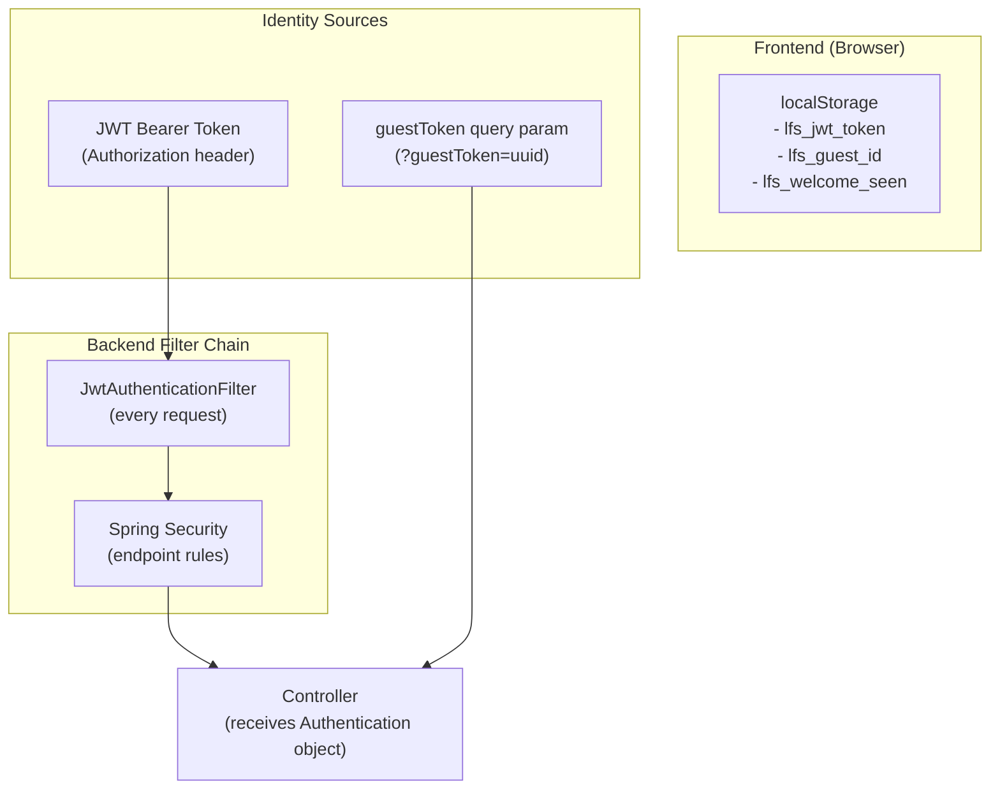
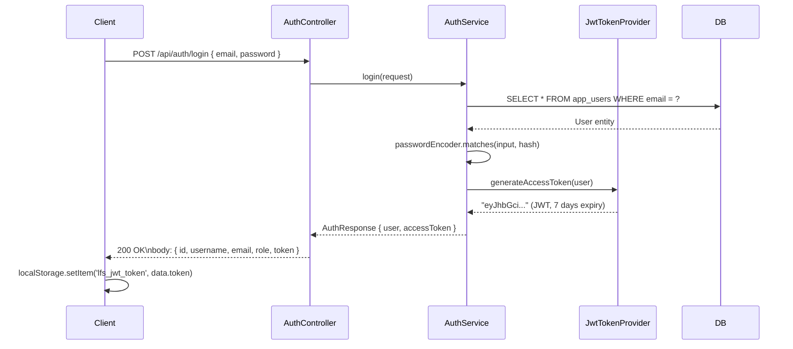
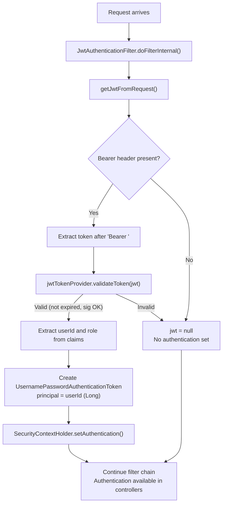
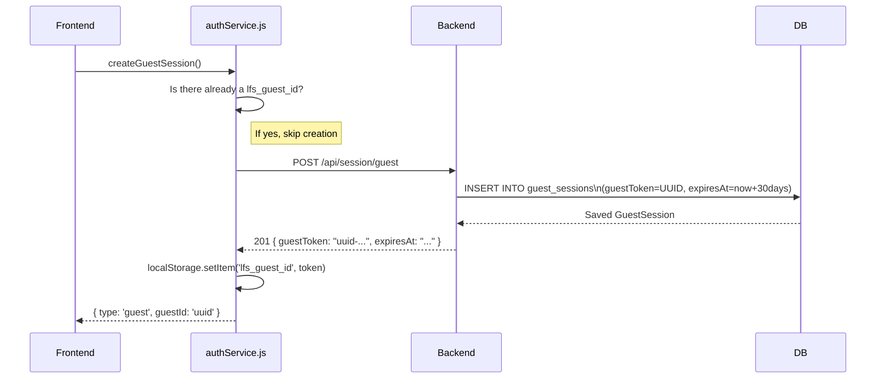

# LFS App — Authentication & Security

> **Audience:** Developers who need to understand the security model, add authentication features, or audit the security posture  
> **Key concept:** This app has TWO identity systems running in parallel — JWTs for registered users and UUID tokens for guests.

---

## 1. Authentication Architecture Overview



The backend identity resolution priority:
1. **JWT in `Authorization: Bearer` header** → sets Spring `Authentication` object
2. **`?guestToken=` query parameter** → handled manually in FileController/LimitsController
3. **Nothing** → `Authentication` is null; may be 401 depending on endpoint

---

## 2. JWT Flow — Registered Users

### 2a. Token Generation at Login



### 2b. JWT Structure

The JWT payload (claims):
```json
{
  "sub": "42",              // User ID (used to look up user)
  "username": "ram",        // Display name
  "email": "ram@example.com",
  "role": "ROLE_USER",      // Used for authorization
  "iat": 1718800000,        // Issued at (Unix timestamp)
  "exp": 1718803600         // Expires at (1 hour later)
}
```

The JWT is signed with `HS256` (HMAC-SHA256) using the `JWT_SECRET` environment variable (a 256-bit hex key).

### 2c. Token Validation on Each Request



### 2d. Accessing User Identity in Controllers

```java
// In any controller that receives Authentication
public ResponseEntity<?> uploadFile(
    @RequestParam("file") MultipartFile file,
    Authentication authentication,  // Injected by Spring
    ...
) {
    if (authentication != null 
        && authentication.isAuthenticated() 
        && authentication.getPrincipal() instanceof Long) {
        
        Long userId = (Long) authentication.getPrincipal();  // This is the user ID
        User user = authService.getUserById(userId);
        // ... proceed with user upload
    }
}
```

The principal is set to `userId` (a `Long`) in the filter — not the username or User object. This is a deliberate design choice to avoid a DB call in the filter itself.

### 2e. Cold-Start Resilience: Optimistic JWT Decode + Background Retry

**Problem:** Render (the backend host) spins down containers after ~15 minutes of inactivity. First visits after a cold period caused a 30–60 second delay on `/auth/me`. The old code interpreted any non-200 response (including 503 Service Unavailable) as "no session", then created a fake local guest ID — overwriting the user's valid JWT.

**Solution implemented in `authService.js` + `AuthContext.jsx`:**

```
Phase 1 — Instant (checkSession, no network):
  1. Read lfs_jwt_token from localStorage
  2. decodeJwtPayload(token)  → base64-decode the JWT payload
  3. isJwtExpired(token)      → check exp claim vs Date.now()
  4. If not expired → getUserFromJwt() → return { type:'signed-in', user, optimistic: true }
  5. User sees their name immediately, app is interactive

Phase 2 — Background (verifySessionWithRetry, in parallel):
  Attempt 1: GET /api/auth/me → wait 4s if fails
  Attempt 2: GET /api/auth/me → wait 8s if fails
  Attempt 3: GET /api/auth/me → wait 12s if fails
  Attempt 4: GET /api/auth/me → wait 16s if fails
  Attempt 5: GET /api/auth/me → wait 20s if fails
  Attempt 6: GET /api/auth/me → give up if fails (after 60s total)

  On 200 OK  → update authState with server-authoritative user data
  On 401     → JWT is actually invalid → downgrade to type:'new'
  On null    → backend still unreachable → keep optimistic state
```

**Key behaviour changes:**
- `createGuestSession()` no longer has a local fallback. It throws if the backend is unreachable.
- `checkSession()` catches that throw and returns `type: 'new'` (honest) instead of creating a fake local guest ID (broken).
- The `getLimits()` fallback now returns **registered-user defaults** (100MB) when a JWT is present, not guest defaults (5MB). This prevents upload size rejections during cold-start when limits can't be fetched.

> **Security note on client-side JWT decode:** `decodeJwtPayload()` uses `atob()` to read the JWT claims — it does **not** verify the signature. A user could theoretically modify their JWT payload bytes. However, every actual API call (upload, limits, download) is validated by `JwtAuthenticationFilter` on the backend which **does** verify the signature via `JwtTokenProvider.validateToken()`. The optimistic decode is only used for the UI display (showing username in the Navbar) — never for access control decisions.

---

## 3. Guest Session Flow

Guest sessions use a completely different mechanism — no JWT, no database-based session:

### 3a. Guest Session Creation



### 3b. Guest Session Validation

On every request that uses a guest token:

```java
// FileController.java or LimitsController.java
if (guestToken != null && !guestToken.isEmpty()) {
    if (!authService.isValidGuestSession(guestToken)) {
        return ResponseEntity.status(401).body(new ErrorResponse(401, "Invalid or expired guest session"));
    }
    GuestSession guestSession = authService.getGuestSession(guestToken);
    // ... proceed
}
```

```java
// AuthService.java
public boolean isValidGuestSession(String guestToken) {
    GuestSession session = guestSessionRepository.findByGuestToken(guestToken).orElse(null);
    return session != null && !session.isExpired();
}
```

### 3c. Guest Session Validation Endpoint

The frontend validates the stored guest token on app load:
```
GET /api/session/validate?guestToken={uuid}
→ { "valid": true } or { "valid": false }
```

This is a public endpoint — no auth required. If the session is invalid (expired or not found), the frontend clears localStorage and creates a new one.

---

## 4. Token Storage

JWTs are stored in the browser's `localStorage` as `lfs_jwt_token`. On subsequent requests, the frontend reads the token and passes it in the `Authorization: Bearer <token>` HTTP header.


---

## 5. Password Security

Passwords use **BCrypt** with Spring Security's default strength (10 rounds):

```java
// SecurityConfig.java
@Bean
public PasswordEncoder passwordEncoder() {
    return new BCryptPasswordEncoder();
}
```

```java
// AuthService.java - storing password
user.setPasswordHash(passwordEncoder.encode(request.getPassword()));

// AuthService.java - verifying password
if (!passwordEncoder.matches(request.getPassword(), user.getPasswordHash())) {
    throw new IllegalArgumentException("Invalid email or password");
}
```

BCrypt is a one-way adaptive hash function. Properties:
- Same password hashes to a different string each time (random salt)
- Cannot be reversed to find the original password
- Deliberately slow (10 rounds ≈ ~100ms per check) to make brute-force attacks impractical

---

## 6. CORS Configuration

The backend allows cross-origin requests from specific origins:

```java
// SecurityConfig.java
List<String> allowedOrigins = Arrays.asList(
    frontendUrl,              // env: FRONTEND_URL (production Vercel URL)
    "http://localhost:5173",  // Vite dev server
    "http://localhost:3000",  // Alternative frontend port
    "http://localhost:8080"   // Backend localhost (for testing)
);

configuration.setAllowCredentials(true);  // Allowed for credentials/headers
configuration.setAllowedHeaders(Arrays.asList("*"));  // All headers allowed
configuration.setAllowedMethods(Arrays.asList("GET", "POST", "PUT", "DELETE", "OPTIONS", "PATCH"));
```

---

## 7. HTTP Security Headers

The backend adds security headers to every response:

```java
// SecurityConfig.java
http.headers(headers -> {
    headers.contentSecurityPolicy(csp -> csp.policyDirectives(
        "default-src 'self' https:; " +
        "img-src 'self' data: https://res.cloudinary.com; " +  // Cloudinary images allowed
        "script-src 'self' 'unsafe-inline' https:; " +
        "object-src 'none';"
    ));
    headers.frameOptions(frame -> frame.sameOrigin());        // X-Frame-Options: SAMEORIGIN
    headers.httpStrictTransportSecurity(hsts ->               // HSTS: 1 year
        hsts.includeSubDomains(true).maxAgeInSeconds(31536000)
    );
    headers.contentTypeOptions(cto -> {});                    // X-Content-Type-Options: nosniff
});
```

| Header | Value | Protection |
|---|---|---|
| `Content-Security-Policy` | (see above) | Prevents XSS, injection |
| `X-Frame-Options` | `SAMEORIGIN` | Prevents clickjacking |
| `Strict-Transport-Security` | `max-age=31536000; includeSubDomains` | Forces HTTPS |
| `X-Content-Type-Options` | `nosniff` | Prevents MIME type sniffing |

---

## 8. Access Control Rules Summary

| Endpoint | Method | Auth Required | Notes |
|---|---|---|---|
| `/api/auth/register` | POST | None | Public sign-up |
| `/api/auth/login` | POST | None | Public login |
| `/api/auth/logout` | POST | JWT | Logs out user (clears local token on frontend) |
| `/api/auth/me` | GET | JWT | Returns user profile |
| `/api/auth/verify` | GET | JWT | Validates token |
| `/api/session/guest` | POST | None | Creates guest session |
| `/api/session/validate` | GET | None | Validates guest token |
| `/api/session/current` | GET | None | Gets guest session info |
| `/api/limits/current` | GET | JWT or guestToken | Returns limits for current user |
| `/api/files/upload` | POST | JWT or guestToken | Uploads file |
| `/api/files/info/{token}` | GET | None | File metadata (public) |
| `/api/files/download/{token}` | GET | None | Download (public) |

> **Key observation:** File info and downloads are **completely public**. Anyone with the share token can see file metadata and download. This is by design — the token IS the authorization. There's no per-user download permission system.

---

## 9. Security Considerations and Potential Vulnerabilities

### ✅ What's Well-Protected

- **Passwords:** BCrypt hashed, never logged or returned
- **JWT signing:** Long random secret key (256-bit hex), HS256 algorithm
- **CORS:** Explicit allowlist, not wildcard
- **SQL injection:** Impossible via JPA parameterized queries
- **DB connection:** SSL required (`sslmode=require` on Supabase)
- **Render cold-start auth:** Optimistic JWT decode + background retry prevents phantom guest session creation when backend is waking up (fixed)

### ⚠️ Known Limitations / Future Concerns

| Issue | Risk Level | Description |
|---|---|---|
| Guest token in URL | Low | The `guestToken` is sent as a query parameter in URLs like `/api/files/upload?guestToken=xxx`. This means the token can appear in server logs. |
| No file type validation | Medium | The backend accepts any file type. Malicious files (e.g., executables) can be uploaded and shared. Consider adding MIME type allowlists. |
| No download limits enforced | Low | `UserLimits.maxDownloads` is stored but never enforced in the download endpoint. The limit exists in the DB but has no enforcement logic. |
| Memory-based file proxying | Medium | `Files.readAllBytes()` and `fetchRemoteFile()` load entire files into JVM heap. A 100 MB file would allocate 100 MB of memory per concurrent download. |
| No rate limiting | Medium | No protection against brute-force token guessing or upload flooding. Should add Spring's rate limiting or an API gateway like Cloudflare. |
| JWT secret in .env | High | The `.env` file in the repo contains the actual JWT secret and database credentials. This `.env` file is in `.gitignore` but if committed accidentally it would expose all secrets. |

### 🔒 Recommendations for Future Contributors

1. **Add file type allowlist:** Validate MIME types on upload (e.g., only allow documents, images, archives)
2. **Stream large files:** Replace `readAllBytes()` with streaming responses using `InputStreamResource`
3. **Add rate limiting:** Use Spring Boot rate limiting or a Cloudflare WAF rule
4. **Move guest token to header:** Send guestToken in a custom header (`X-Guest-Token`) instead of URL query param to keep it out of logs
5. **Enforce download limits:** Add a check in `FileController.downloadFile()` against `UserLimits.maxDownloads`
