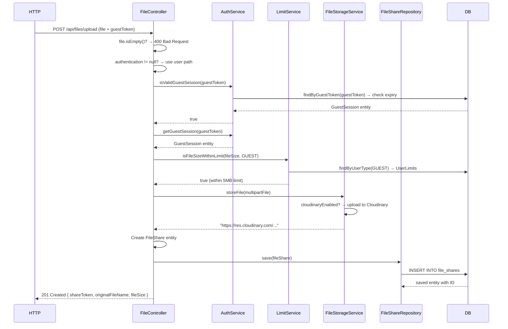
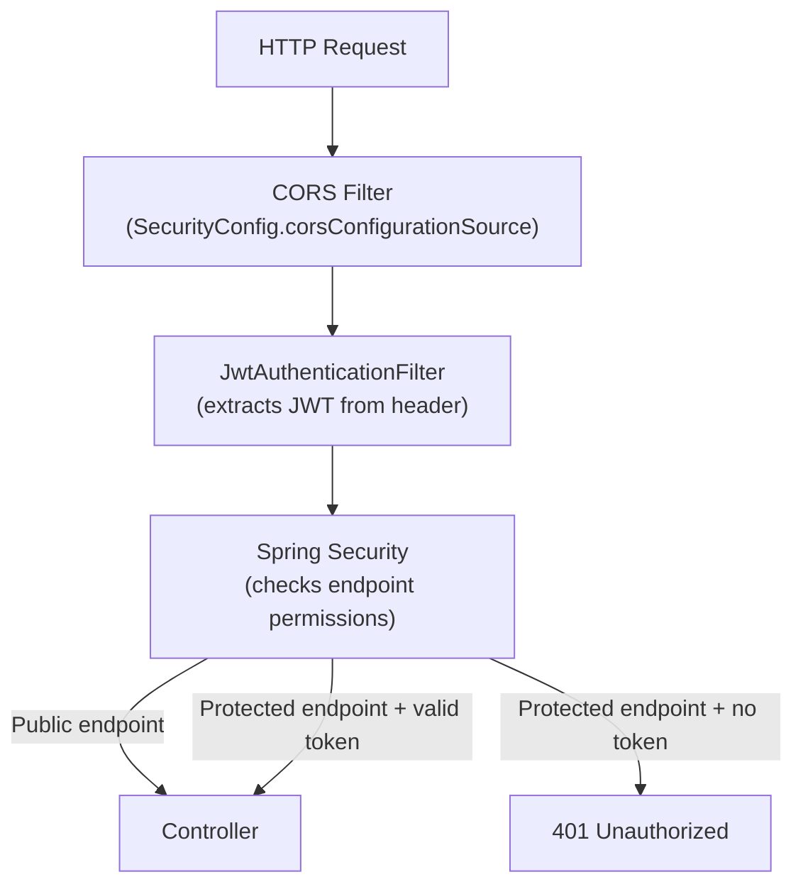

# LFS App — Backend Flow

> **Audience:** Developers new to Spring Boot or inheriting the backend  
> **Goal:** Understand how HTTP requests are processed, how authentication works, how the code is structured, and why design decisions were made.

---

## 1. Spring Boot Architecture Overview

The backend is a classic **Spring Boot REST API** with a layered architecture:

```
HTTP Request
    ↓
[Filter Chain] — JwtAuthenticationFilter (runs before every request)
    ↓
[Spring Security] — checks permissions (is this endpoint public or authenticated?)
    ↓
[Controller] — receives HTTP request, validates input, delegates to service
    ↓
[Service] — business logic, orchestrates repositories
    ↓
[Repository] — database access (Spring Data JPA auto-implements interfaces)
    ↓
[Database] — PostgreSQL on Supabase
```

### Why this layered approach?
- **Separation of concerns:** Controllers don't know about databases; services don't know about HTTP
- **Testability:** Each layer can be tested in isolation
- **Maintainability:** Changing the database layer doesn't affect controllers

---

## 2. Application Entry Point

**[`BackendApplication.java`](../backend/src/main/java/com/lfs/backend/BackendApplication.java)** starts the application:

```java
@SpringBootApplication
public class BackendApplication {
    public static void main(String[] args) {
        // Custom: manually load .env file (Spring doesn't do this by default)
        if (Files.exists(Paths.get(".env"))) {
            // Parse KEY=VALUE lines, call System.setProperty(key, value)
            // This lets Spring read env vars from .env in development
        }
        SpringApplication.run(BackendApplication.class, args);
    }
}
```

> **Why manual .env loading?** Spring Boot reads OS environment variables and `application.properties`. It does NOT natively read `.env` files. In production (Render), env vars are set on the dashboard. Locally, the `.env` file is parsed manually at startup so developers don't have to set system env vars.

---

## 3. Package Structure

```
com.lfs.backend
├── BackendApplication.java    → @SpringBootApplication entry point
├── config/
│   ├── SecurityConfig.java    → @Configuration: security chain, CORS, BCrypt
│   └── ApplicationStartup.java → @EventListener: runs DB init after startup
├── controller/                → @RestController: HTTP request handlers
├── service/                   → @Service: business logic
├── repository/                → extends JpaRepository: database access
├── entity/                    → @Entity: JPA-mapped database tables
├── dto/                       → Plain Java classes: request/response shapes
└── util/                      → @Component: JWT utilities and filter
```

---

## 4. Dependency Injection Explained

Spring Boot uses **Dependency Injection (DI)** — instead of creating objects manually with `new`, you declare what you need and Spring creates and injects it.

**Constructor Injection (preferred — used in FileController):**
```java
@RestController
public class FileController {
    
    private final FileStorageService fileStorageService;
    private final AuthService authService;

    @Autowired  // Spring reads this annotation and injects the beans
    public FileController(FileStorageService fileStorageService, AuthService authService) {
        this.fileStorageService = fileStorageService;
        this.authService = authService;
    }
}
```

**Field Injection (also used — simpler but less testable):**
```java
@Service
public class AuthService {
    @Autowired
    private UserRepository userRepository;
    
    @Autowired
    private JwtTokenProvider jwtTokenProvider;
}
```

> **Why DI?** You never manually create `new AuthService()`. Spring manages one shared instance (a "bean") and passes it wherever needed. This means you can easily swap implementations (e.g., use a mock repository in tests).

---

## 5. Controller → Service → Repository Flow

### Example: File Upload



### The Controller's Job
Controllers handle:
- Parsing HTTP request parameters
- Making high-level routing decisions (authenticated user vs guest)
- Calling services
- Mapping results to HTTP responses (status codes + body)
- Exception handling (try/catch mapping to 400/404/500)

### The Service's Job
Services handle:
- Business logic (e.g., "is this guest session valid? is it expired?")
- Orchestrating multiple repository calls in a transaction
- Throwing `IllegalArgumentException` for business rule violations

### The Repository's Job
Repositories are **interfaces** only. Spring Data JPA automatically generates the SQL:
```java
// FileShareRepository.java
public interface FileShareRepository extends JpaRepository<FileShare, Long> {
    Optional<FileShare> findByShareToken(String shareToken);
    // Spring auto-generates: SELECT * FROM file_shares WHERE share_token = ?
}
```

---

## 6. Security Architecture

### 6a. The Security Filter Chain

Every HTTP request passes through the security chain defined in [`SecurityConfig.java`](../backend/src/main/java/com/lfs/backend/config/SecurityConfig.java):



### 6b. Public vs Protected Endpoints

```java
// SecurityConfig.java - authorization rules
.authorizeHttpRequests(authz -> authz
    // PUBLIC - anyone can call these
    .requestMatchers(HttpMethod.POST, "/api/auth/register").permitAll()
    .requestMatchers(HttpMethod.POST, "/api/auth/login").permitAll()
    .requestMatchers(HttpMethod.POST, "/api/session/guest").permitAll()
    .requestMatchers(HttpMethod.GET, "/api/session/validate").permitAll()
    .requestMatchers(HttpMethod.GET, "/api/limits/current").permitAll()
    .requestMatchers(HttpMethod.GET, "/api/files/download/**").permitAll()
    .requestMatchers(HttpMethod.GET, "/api/files/info/**").permitAll()
    .requestMatchers(HttpMethod.POST, "/api/files/upload").permitAll()

    // PROTECTED - require JWT
    .requestMatchers(HttpMethod.POST, "/api/auth/logout").authenticated()
    .requestMatchers(HttpMethod.GET, "/api/auth/me").authenticated()
    .requestMatchers(HttpMethod.GET, "/api/auth/verify").authenticated()
    
    // ALL OTHERS - require authentication
    .anyRequest().authenticated()
)
```

> **Why is `/api/files/upload` public?** The endpoint itself is accessible without a JWT, but the `FileController` performs its own authentication check — it requires either a valid JWT (for registered users) or a valid guest token (for guests). This allows both user types to upload while letting Spring Security remain stateless (no session management at the framework level).

### 6c. JWT Authentication Filter

[`JwtAuthenticationFilter.java`](../backend/src/main/java/com/lfs/backend/util/JwtAuthenticationFilter.java) runs on **every request** and looks for a JWT in the `Authorization` header:

```java
private String getJwtFromRequest(HttpServletRequest request) {
    // Check Authorization header: "Bearer <token>"
    String bearerToken = request.getHeader("Authorization");
    if (bearerToken != null && bearerToken.startsWith("Bearer ")) {
        return bearerToken.substring(7);
    }
    return null;
}
```

If a valid JWT is found, the filter sets the `Authentication` object in `SecurityContextHolder`:
```java
UsernamePasswordAuthenticationToken authentication =
    new UsernamePasswordAuthenticationToken(userId, null, authorities);
SecurityContextHolder.getContext().setAuthentication(authentication);
```

This makes the `authentication` parameter auto-populated in controller methods:
```java
@PostMapping("/upload")
public ResponseEntity<?> uploadFile(
    @RequestParam("file") MultipartFile file,
    Authentication authentication,  // ← Auto-populated by Spring if JWT was valid
    @RequestParam(value = "guestToken", required = false) String guestToken
)
```

---

## 7. JWT Token Generation and Validation

[`JwtTokenProvider.java`](../backend/src/main/java/com/lfs/backend/util/JwtTokenProvider.java) handles all JWT operations using **JJWT 0.11.5**:

### Token Generation
```java
private String generateToken(User user, long expirationTime) {
    SecretKey key = Keys.hmacShaKeyFor(jwtSecret.getBytes());
    
    return Jwts.builder()
        .setSubject(String.valueOf(user.getId()))  // Subject = user ID
        .claim("username", user.getUsername())
        .claim("email", user.getEmail())
        .claim("role", user.getRole().toString())
        .setIssuedAt(new Date())
        .setExpiration(new Date(now.getTime() + expirationTime))
        .signWith(key, SignatureAlgorithm.HS256)  // HMAC-SHA256 signature
        .compact();
}
```

**Access token:** Expires in 7 days (`JWT_ACCESS_TOKEN_EXPIRATION=604800000` ms)  


### Token Validation
```java
public boolean validateToken(String token) {
    try {
        Jwts.parserBuilder()
            .setSigningKey(key)
            .build()
            .parseClaimsJws(token);  // Throws if expired or signature invalid
        return true;
    } catch (Exception e) {
        return false;  // Any exception = invalid token
    }
}
```

---

## 8. Request Processing Lifecycle in Detail

For every HTTP request, here's the exact sequence:

```
1. Tomcat receives HTTP request
2. Spring's DispatcherServlet intercepts
3. JwtAuthenticationFilter.doFilterInternal() runs:
   a. Extract JWT from header
   b. If valid: set Authentication in SecurityContextHolder
   c. Always: filterChain.doFilter() → continue
4. Spring Security checks endpoint permissions:
   a. Is endpoint public? → proceed
   b. Is endpoint protected and Authentication set? → proceed
   c. Is endpoint protected and no Authentication? → 401 response, stop
5. Controller method is invoked:
   a. @RequestParam, @PathVariable, @RequestBody are deserialized
   b. Authentication object is auto-injected (may be null for public endpoints)
6. Controller calls Service methods
7. Service calls Repository methods (JPA SQL queries)
8. Response is serialized to JSON
9. HTTP response sent
```

---

## 9. File Handling Process

[`FileStorageService.java`](../backend/src/main/java/com/lfs/backend/service/FileStorageService.java) implements a **storage abstraction**:

```java
public String storeFile(MultipartFile file) throws IOException {
    if (cloudinaryEnabled) {
        // Production path: upload to Cloudinary, return secure_url
        return cloudinaryService.uploadFile(file);  // Returns "https://..."
    }
    
    // Development fallback: save to local /uploads directory
    String fileName = UUID.randomUUID() + extractExtension(file);
    Path filePath = Paths.get("uploads").resolve(fileName);
    Files.copy(file.getInputStream(), filePath);
    return filePath.toString();  // Returns "uploads/uuid.ext"
}
```

**Download logic** distinguishes between local and remote storage:
```java
// FileController.java
if (fileStorageService.isRemoteUrl(fileShare.getStoragePath())) {
    // Cloudinary URL → proxy server-side (avoids CORS issues)
    fileContent = fileStorageService.fetchRemoteFile(fileShare.getStoragePath());
} else {
    // Local path → read from filesystem
    fileContent = fileStorageService.retrieveFile(fileShare.getStoragePath());
}
```

> **Why server-side proxy for Cloudinary?** Cloudinary URLs can't be downloaded directly by the browser due to CORS policies on Cloudinary's CDN when the request originates from a different domain than what Cloudinary is configured for. The backend fetches the bytes and streams them to the client, acting as a proxy.

---

## 10. Error Handling Strategy

The backend uses a consistent pattern throughout:

### Controller-Level Error Handling
```java
@PostMapping("/upload")
public ResponseEntity<?> uploadFile(...) {
    try {
        // ... business logic
        return ResponseEntity.status(HttpStatus.CREATED).body(response);
    } catch (IllegalArgumentException e) {
        // Business rule violation → 400 Bad Request
        return ResponseEntity.badRequest().body(new ErrorResponse(400, e.getMessage()));
    } catch (IOException e) {
        // File system error → 500 Internal Server Error
        return ResponseEntity.status(HttpStatus.INTERNAL_SERVER_ERROR)
            .body(new ErrorResponse(500, "File upload failed: " + e.getMessage()));
    } catch (Exception e) {
        // Catch-all → 500
        return ResponseEntity.status(HttpStatus.INTERNAL_SERVER_ERROR)
            .body(new ErrorResponse(500, "An unexpected error occurred: " + e.getMessage()));
    }
}
```

### Service-Level Validation
```java
// AuthService.java
public AuthResponse register(RegisterRequest request) {
    if (!request.getPassword().equals(request.getPasswordConfirm())) {
        throw new IllegalArgumentException("Passwords do not match");
    }
    if (userRepository.findByEmail(request.getEmail()).isPresent()) {
        throw new IllegalArgumentException("Email already registered");
    }
    // ...
}
```

Services throw `IllegalArgumentException` for business rule violations. Controllers catch these and return 400 responses. This keeps validation logic in the service layer while HTTP status codes stay in controllers.

### ErrorResponse DTO
```java
// Consistent error format for all error responses
public class ErrorResponse {
    private int status;
    private String message;
    private LocalDateTime timestamp;
}
```

---

## 11. ApplicationStartup: Database Initialization

[`ApplicationStartup.java`](../backend/src/main/java/com/lfs/backend/config/ApplicationStartup.java) runs once when the app is ready:

```java
@EventListener(ApplicationReadyEvent.class)
public void initializeDefaultLimits() {
    // Fix schema evolution issue: drop old CHECK constraint that didn't include ANONYMOUS
    jdbcTemplate.execute("ALTER TABLE download_logs DROP CONSTRAINT IF EXISTS download_logs_downloader_type_check");
    
    // Insert default limits if they don't exist
    limitService.initializeDefaultLimits();
}
```

This initializes the `user_limits` table with default values:
- **GUEST:** 10 uploads, 5 MB per file, 500 MB total, 50 downloads
- **REGISTERED:** 100 uploads, 100 MB per file, 10 GB total, 1000 downloads

> **Why seed limits in code?** This ensures the app always has valid limits even on fresh deployments, without requiring manual SQL or migration scripts.

---

## 12. Dependencies (from pom.xml)

| Dependency | Version | Purpose |
|---|---|---|
| `spring-boot-starter-web` | 4.0.6 (parent) | Web MVC, Tomcat server, REST |
| `spring-boot-starter-data-jpa` | 4.0.6 | Hibernate ORM, Spring Data repositories |
| `spring-boot-starter-security` | 4.0.6 | Security filter chain, BCrypt |
| `spring-boot-starter-validation` | 4.0.6 | `@Valid`, `@NotNull` on DTOs |
| `jjwt-api`, `jjwt-impl`, `jjwt-jackson` | 0.11.5 | JWT generation and parsing |
| `postgresql` | (runtime) | JDBC driver for PostgreSQL |
| `cloudinary-http44` | 1.38.0 | Cloudinary Java SDK for file storage |
