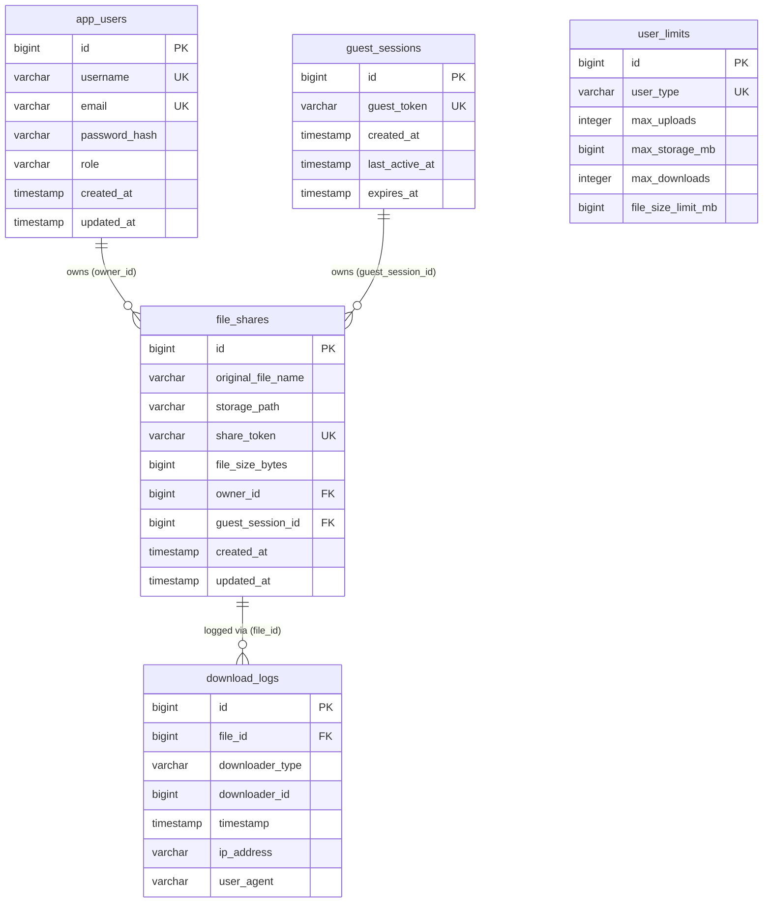
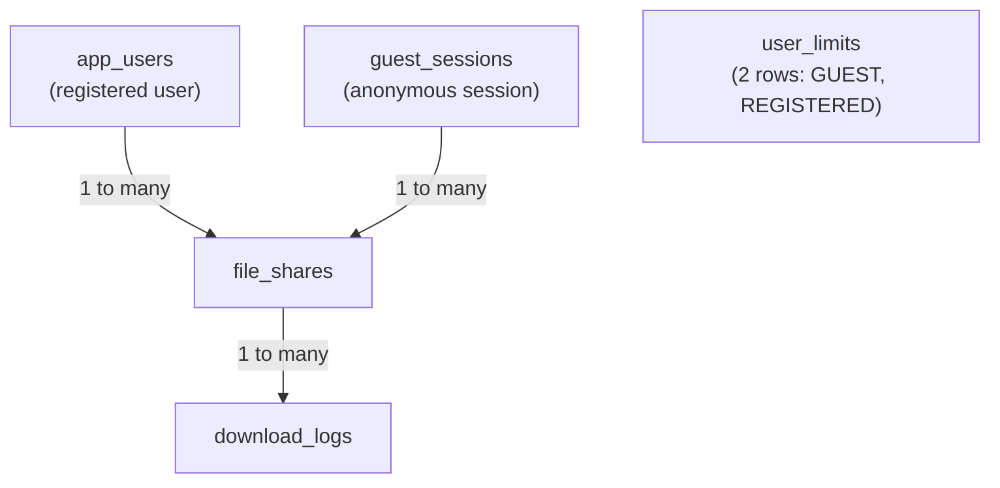

# LFS App — Database Design

> **Audience:** Developers who need to understand or modify the data model  
> **Database:** PostgreSQL 15+ hosted on Supabase (AWS ap-southeast-2)  
> **ORM:** Hibernate (via Spring Data JPA) with `ddl-auto=update`

---

## 1. Entity Relationship Diagram



---

## 2. Table-by-Table Explanation

### `app_users` — Registered Users

Maps to [`User.java`](../backend/src/main/java/com/lfs/backend/entity/User.java)

| Column | Type | Constraints | Description |
|---|---|---|---|
| `id` | BIGINT | PK, AUTO_INCREMENT | Surrogate key |
| `username` | VARCHAR(100) | NOT NULL, UNIQUE | Display name for navbar |
| `email` | VARCHAR(255) | NOT NULL, UNIQUE | Login identifier |
| `password_hash` | VARCHAR | NOT NULL | BCrypt hash (never plaintext) |
| `role` | VARCHAR | NOT NULL, default `ROLE_USER` | One of: `ROLE_GUEST`, `ROLE_USER`, `ROLE_ADMIN` |
| `created_at` | TIMESTAMP | NOT NULL, immutable | Set by `@PrePersist` |
| `updated_at` | TIMESTAMP | | Updated by `@PreUpdate` |

> **Why table name `app_users` instead of `users`?** `users` is a reserved word in many SQL databases including PostgreSQL. Using `app_users` avoids quoting conflicts.

> **Why store role in the users table?** Simpler than a separate roles table for a project with only 3 role types. The role is embedded in the JWT token so the backend doesn't need to re-query for it on every request.

---

### `file_shares` — Uploaded Files

Maps to [`FileShare.java`](../backend/src/main/java/com/lfs/backend/entity/FileShare.java)

| Column | Type | Constraints | Description |
|---|---|---|---|
| `id` | BIGINT | PK, AUTO_INCREMENT | Surrogate key |
| `original_file_name` | VARCHAR | NOT NULL | The filename as uploaded by the user |
| `storage_path` | VARCHAR | NOT NULL | Either a Cloudinary URL (`https://res.cloudinary.com/...`) or a local path (`uploads/uuid.ext`) |
| `share_token` | VARCHAR | NOT NULL, UNIQUE | UUID4 — the "access key" for the file |
| `file_size_bytes` | BIGINT | | Size in bytes at upload time |
| `owner_id` | BIGINT | FK → app_users(id), nullable | Set when a registered user uploads |
| `guest_session_id` | BIGINT | FK → guest_sessions(id), nullable | Set when a guest uploads |
| `created_at` | TIMESTAMP | NOT NULL, immutable | Upload timestamp |
| `updated_at` | TIMESTAMP | | Last modification time |

> **Why are both `owner_id` and `guest_session_id` nullable?** A file must be owned by either a registered user OR a guest session — never both. JPA enforces this via `optional = true` on both foreign keys. The `isOwnedByUser()` and `isOwnedByGuest()` helper methods check which is set.

> **Why store `storage_path` as a URL vs a path?** This is the key to the storage abstraction. In production, it's a Cloudinary HTTPS URL. In development, it's a local filesystem path. `FileStorageService.isRemoteUrl()` checks if the value starts with `http://` or `https://` to determine how to serve the file.

---

### `guest_sessions` — Anonymous Sessions

Maps to [`GuestSession.java`](../backend/src/main/java/com/lfs/backend/entity/GuestSession.java)

| Column | Type | Constraints | Description |
|---|---|---|---|
| `id` | BIGINT | PK, AUTO_INCREMENT | Internal ID |
| `guest_token` | VARCHAR(255) | NOT NULL, UNIQUE | UUID4 stored in the browser's localStorage as `lfs_guest_id` |
| `created_at` | TIMESTAMP | NOT NULL, immutable | When the session was created |
| `last_active_at` | TIMESTAMP | | Updated on each DB access (currently only on persist) |
| `expires_at` | TIMESTAMP | | Set to `now() + 30 days` on creation |

The `isExpired()` method checks `LocalDateTime.now().isAfter(expiresAt)`.

> **Why 30-day expiry?** Long enough that casual users can return to download their own files, but short enough to prevent stale sessions accumulating indefinitely.

> **Why UUID for the guest token?** It's unguessable. If a sequential ID were used, an attacker could enumerate all guest sessions. A UUID4 has 2^122 possible values — effectively unforgeable.

---

### `download_logs` — Download Audit Trail

Maps to [`DownloadLog.java`](../backend/src/main/java/com/lfs/backend/entity/DownloadLog.java)

| Column | Type | Constraints | Description |
|---|---|---|---|
| `id` | BIGINT | PK, AUTO_INCREMENT | Internal ID |
| `file_id` | BIGINT | FK → file_shares(id), NOT NULL | Which file was downloaded |
| `downloader_type` | VARCHAR | NOT NULL | One of: `USER`, `GUEST`, `ANONYMOUS` |
| `downloader_id` | BIGINT | nullable | `user.id` if USER, `guest_session.id` if GUEST |
| `timestamp` | TIMESTAMP | NOT NULL, immutable | When the download happened |
| `ip_address` | VARCHAR(45) | | Client IP (IPv6 max = 39 chars, 45 for safety) |
| `user_agent` | VARCHAR(500) | | Browser user agent (truncated to 500 chars) |

> **Why `ANONYMOUS` downloader type?** Download is a public endpoint — no auth token required at all. If someone downloads a file without any session, they're `ANONYMOUS`. The `GUEST` and `USER` types allow correlating downloads back to a specific identity for analytics.

> **Why log downloads at all?** Analytics — knowing how many times each file is downloaded. This data could power features like "this file has been downloaded X times" or usage caps. Currently the data is stored but not surfaced in the UI.

---

### `user_limits` — Per-Tier Limits

Maps to [`UserLimits.java`](../backend/src/main/java/com/lfs/backend/entity/UserLimits.java)

| Column | Type | Constraints | Description |
|---|---|---|---|
| `id` | BIGINT | PK, AUTO_INCREMENT | Internal ID |
| `user_type` | VARCHAR | NOT NULL, UNIQUE | Either `GUEST` or `REGISTERED` |
| `max_uploads` | INTEGER | NOT NULL | Max number of file uploads |
| `max_storage_mb` | BIGINT | NOT NULL | Total storage limit in MB |
| `max_downloads` | INTEGER | NOT NULL | Max downloads limit |
| `file_size_limit_mb` | BIGINT | | Max file size per upload in MB |

Default values (seeded at startup):

| Metric | GUEST | REGISTERED |
|---|---|---|
| Max uploads | 10 | 100 |
| Max storage | 500 MB | 10 GB |
| Max downloads | 50 | 1000 |
| Max file size | 5 MB | 100 MB |

> **Why store limits in the database instead of hardcoding them?** This allows administrators to adjust limits without redeployment. A future admin panel could update these rows dynamically.

---

## 3. Relationships Explained



- **User → FileShare:** One registered user can upload many files. `CASCADETYPE.ALL` means if a user is deleted, all their files are also deleted.
- **GuestSession → FileShare:** One guest session can upload many files. Also CASCADE deleted.
- **FileShare → DownloadLog:** One file can have many download events logged.
- **UserLimits:** No FK relationships — it's a configuration table with just 2 rows.

---

## 4. Schema Evolution Notes

The project uses `spring.jpa.hibernate.ddl-auto=update`. This means Hibernate **automatically updates the schema** when entity classes change (adds columns, creates new tables). It does **not** drop columns or rename them.

**Important caveat in `ApplicationStartup.java`:**
```java
// An ANONYMOUS enum value was added to DownloadLog.DownloaderType after initial deployment.
// PostgreSQL created a CHECK constraint based on the original enum values (GUEST, USER).
// On startup, we drop that constraint so ANONYMOUS downloads can be logged.
jdbcTemplate.execute(
    "ALTER TABLE download_logs DROP CONSTRAINT IF EXISTS download_logs_downloader_type_check"
);
```

This is an example of a **schema migration that Hibernate's ddl-auto couldn't handle automatically**. The CHECK constraint had to be dropped manually. This is a common gotcha with `ddl-auto=update`.

> **Recommendation for future contributors:** For anything beyond simple column additions, use a proper migration tool like **Flyway** or **Liquibase**. Add it to `pom.xml` and write versioned SQL scripts in `src/main/resources/db/migration/`.

---

## 5. Indexing

Hibernate's `ddl-auto=update` creates indexes for:
- All `@Id` (primary key) columns — auto B-tree index
- All `@Column(unique = true)` columns — unique B-tree index

This means the following columns have indexes:
- `app_users.username`, `app_users.email`
- `file_shares.share_token`
- `guest_sessions.guest_token`
- `user_limits.user_type`

**Missing indexes (potential performance issue):**
- `file_shares.owner_id` and `file_shares.guest_session_id` — FK columns should have indexes, especially as data grows, but JPA doesn't auto-index FKs in all databases. Consider adding `@Index` annotations or manual SQL if queries slow down.
- `download_logs.file_id` — This FK is frequently queried. Worth adding an explicit index.

---

## 6. Why This Schema Was Designed This Way

**Simplicity over normalization:** The schema is intentionally simple. For example:
- No separate `roles` table (role is in `app_users`)
- No `files` table separate from `file_shares` (file metadata and sharing are combined)
- Limits are global per tier, not per-user

**Nullable FK pattern for polymorphic ownership:** `file_shares` has two nullable FKs (`owner_id`, `guest_session_id`). This is simpler than a polymorphic association or a separate join table. The tradeoff is you can't enforce "at least one must be non-null" at the database level — it's enforced in application code.

**UUID share tokens:** Using UUID4 as share tokens means:
- No sequential enumeration risk
- The token IS the authorization — no additional permission check needed for downloads (anyone with the token can download)
- Human-readable tokens (UUID with hyphens) that users can easily share
