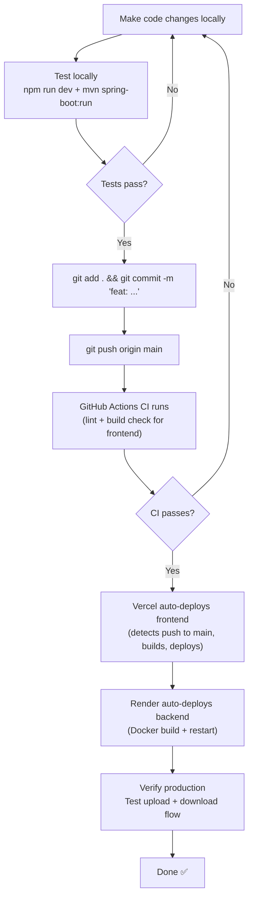

# LFS App — Deployment Guide

> **Audience:** Developers setting up the project locally or deploying to production  
> **Stack:** React (Vercel) + Spring Boot Docker (Render) + PostgreSQL (Supabase) + Cloudinary

---

## 1. Local Development Setup

### Prerequisites

| Tool | Version | Purpose |
|---|---|---|
| Node.js | 24+ | Frontend build and dev server |
| Java JDK | 17+ | Backend compilation and runtime |
| Maven | 3.9+ | Backend build tool (or use included `./mvnw`) |
| Git | Any | Version control |

> **No Docker required for local development.** The backend runs directly with Maven; the frontend runs with Vite.

### Step 1: Clone the Repository

```bash
git clone https://github.com/Ram-ambati/LFS-App.git
cd "LFS App"
```

### Step 2: Set Up the Backend

```bash
cd backend
```

Create/edit `backend/.env` with your credentials (the file already exists — update the values):

```bash
# Database (Supabase)
SPRING_DATASOURCE_URL=jdbc:postgresql://your-host.supabase.com:5432/postgres?sslmode=require
SPRING_DATASOURCE_USERNAME=postgres.your_project_id
SPRING_DATASOURCE_PASSWORD=your_password

# JWT Secret (generate a long random string)
JWT_SECRET=your-very-long-secret-at-least-256-bits

# Environment
APP_ENVIRONMENT=development
FRONTEND_URL=http://localhost:5173

# Cloudinary (optional for local dev — omit to use local file storage)
CLOUDINARY_CLOUD_NAME=your_cloud_name
CLOUDINARY_API_KEY=your_api_key
CLOUDINARY_API_SECRET=your_api_secret
CLOUDINARY_UPLOAD_FOLDER=lfs-app/uploads

# Hibernate
SPRING_JPA_HIBERNATE_DDL_AUTO=update
```

Start the backend:
```bash
# Using Maven wrapper (no separate Maven install needed)
./mvnw spring-boot:run

# Or if you have Maven installed
mvn spring-boot:run
```

The backend will start on `http://localhost:8080`. You'll see:
```
✓ Loaded environment variables from .env file
✓ Default user limits initialized
Started BackendApplication in X.XX seconds
```

### Step 3: Set Up the Frontend

```bash
cd frontend
npm install
```

The `.env` file for local development:
```bash
# frontend/.env (already present - should point to localhost for dev)
VITE_API_BASE_URL=http://localhost:8080/api
```

> **Alternative:** Leave `VITE_API_BASE_URL` unset and use the Vite proxy instead. The `vite.config.js` proxies `/api` requests to `localhost:8080` automatically.

Start the frontend:
```bash
npm run dev
```

Open `http://localhost:5173` in your browser.

### Step 4: Verify Everything Works

1. Visit `http://localhost:5173` — you should see the WelcomeModal
2. Click "Continue as Guest" — should create a guest session (check backend logs)
3. Upload a small file — should save to `backend/uploads/` directory
4. Copy the share token, go to `/download`, paste the token, and download the file

---

## 2. Environment Variables Reference

### Backend Environment Variables

| Variable | Required | Default | Description |
|---|---|---|---|
| `SPRING_DATASOURCE_URL` | ✅ | — | PostgreSQL JDBC URL |
| `SPRING_DATASOURCE_USERNAME` | ✅ | — | DB username |
| `SPRING_DATASOURCE_PASSWORD` | ✅ | — | DB password |
| `JWT_SECRET` | ✅ | (insecure default) | HS256 signing key (min 32 chars) |
| `JWT_ACCESS_TOKEN_EXPIRATION` | ❌ | `3600000` | Access token lifetime (ms) |
| `JWT_REFRESH_TOKEN_EXPIRATION` | ❌ | `2592000000` | Refresh token lifetime (ms) |
| `APP_ENVIRONMENT` | ❌ | `development` | `development` or `production` |
| `FRONTEND_URL` | ❌ | `http://localhost:5173` | Allowed CORS origin |
| `SPRING_JPA_HIBERNATE_DDL_AUTO` | ❌ | `update` | Schema management |
| `CLOUDINARY_CLOUD_NAME` | ❌ | — | Enables Cloudinary if set |
| `CLOUDINARY_API_KEY` | ❌ | — | Cloudinary API key |
| `CLOUDINARY_API_SECRET` | ❌ | — | Cloudinary API secret |
| `CLOUDINARY_UPLOAD_FOLDER` | ❌ | `lfs-app/uploads` | Cloudinary folder path |

### Frontend Environment Variables

| Variable | Required | Default | Description |
|---|---|---|---|
| `VITE_API_BASE_URL` | ✅ (prod) | `http://localhost:8080/api` | Backend API URL |

> **Note:** All Vite env vars must be prefixed with `VITE_` to be accessible in the browser bundle.

---

## 3. Docker Architecture

The backend is containerized for production deployment. The `Dockerfile` uses a **multi-stage build**:

```dockerfile
# Stage 1: Build — heavy Maven + JDK image, only for compilation
FROM maven:3.9-eclipse-temurin-17-alpine AS builder
WORKDIR /app
COPY pom.xml .
RUN mvn dependency:go-offline -B    # Pre-download deps (layer cache)
COPY src ./src
RUN mvn clean package -DskipTests  # Build the fat JAR

# Stage 2: Runtime — lightweight JRE only image
FROM eclipse-temurin:17-jre-alpine
WORKDIR /app

# Security: run as non-root user
RUN addgroup -S spring && adduser -S spring -G spring
RUN mkdir -p uploads && chown -R spring:spring uploads
USER spring:spring

# Copy only the built JAR from stage 1
COPY --from=builder /app/target/*.jar app.jar

EXPOSE 8080
ENTRYPOINT ["java", "-jar", "app.jar"]
```

**Why multi-stage?**
- Stage 1 uses Maven + full JDK (~500 MB image) — needed only for compilation
- Stage 2 uses only JRE Alpine (~80 MB) — runs the compiled JAR
- Final image is ~80 MB instead of ~500 MB

**Build the Docker image locally:**
```bash
cd backend
docker build -t lfs-backend .
docker run -p 8080:8080 --env-file .env lfs-backend
```

---

## 4. Render Deployment (Backend)

[Render](https://render.com) hosts the backend as a **Docker container**.

### Initial Setup

1. Go to [render.com](https://render.com) → New → Web Service
2. Connect your GitHub repository
3. Configure:
   - **Root Directory:** `backend`
   - **Environment:** `Docker`
   - **Docker Build Context:** `backend` (or root if `Dockerfile` is at root)
   - **Port:** `8080`

### Environment Variables on Render

Set all backend env vars in the Render dashboard (Environment tab):

```
SPRING_DATASOURCE_URL = jdbc:postgresql://...supabase.com:5432/postgres?sslmode=require
SPRING_DATASOURCE_USERNAME = postgres.your_project_id
SPRING_DATASOURCE_PASSWORD = your_supabase_password
JWT_SECRET = your_256bit_secret_key
APP_ENVIRONMENT = production
FRONTEND_URL = https://your-app.vercel.app
CLOUDINARY_CLOUD_NAME = your_cloud_name
CLOUDINARY_API_KEY = your_api_key
CLOUDINARY_API_SECRET = your_api_secret
SPRING_JPA_HIBERNATE_DDL_AUTO = update
```

> **Critical:** Set `APP_ENVIRONMENT=production`. This enables `SameSite=None; Secure` on cookies. Without it, login cookies won't work cross-domain.

> **Critical:** Set `FRONTEND_URL` to your exact Vercel URL (e.g., `https://lfs-app.vercel.app`). CORS will block requests from any other origin.

### Deploy

Every push to `main` triggers a new Render build (if auto-deploy is enabled).

**Render free tier limitation:** The service spins down after 15 minutes of inactivity. The first request after inactivity takes ~30-60 seconds to respond (cold start). The free tier does not support persistent disk storage — Cloudinary is mandatory for production on the free tier.

---

## 5. Vercel Deployment (Frontend)

### Initial Setup

1. Go to [vercel.com](https://vercel.com) → Add New Project
2. Import your GitHub repository
3. Configure:
   - **Framework Preset:** Vite
   - **Root Directory:** `frontend`
   - **Build Command:** `npm run build`
   - **Output Directory:** `dist`

### Environment Variables on Vercel

In the Vercel dashboard → Settings → Environment Variables:

```
VITE_API_BASE_URL = https://lfs-app.onrender.com/api
```

### vercel.json — SPA Routing Fix

The `frontend/vercel.json` file is critical for React Router to work:

```json
{
  "rewrites": [
    {
      "source": "/(.*)",
      "destination": "/index.html"
    }
  ]
}
```

**Why this is needed:** When a user navigates directly to `https://your-app.vercel.app/download/some-token`, Vercel's CDN would look for a file at that path and return 404. The rewrite rule tells Vercel: "For all URLs, serve `index.html`." React Router then handles the routing client-side.

### Vercel Analytics

The project includes Vercel Analytics and Speed Insights:
```jsx
// main.jsx
import { injectSpeedInsights } from '@vercel/speed-insights'
injectSpeedInsights()

// App.jsx
import { Analytics } from '@vercel/analytics/react'
<Analytics />
```

These are automatically activated when deployed to Vercel. They track page views and Core Web Vitals. No configuration needed.

---

## 6. Supabase Configuration

### Why Supabase

Supabase provides **managed PostgreSQL** with:
- Free tier: 500 MB database, unlimited API requests
- Connection pooling via PgBouncer (the URL contains `pooler.supabase.com`)
- Dashboard with Table Editor, SQL Editor, and Logs
- Automatic SSL (required by the backend's `sslmode=require`)

### Setting Up Supabase (Fresh Project)

1. Go to [supabase.com](https://supabase.com) → New Project
2. Choose region closest to Render server (AWS region)
3. Set a strong database password
4. Get your connection string from Settings → Database → Connection String → URI
   - Use the **Pooler** connection string for production (better connection management)

### Connection String Format
```
jdbc:postgresql://aws-1-ap-southeast-2.pooler.supabase.com:5432/postgres?sslmode=require
```

Note: The username for pooler connections uses the project-prefixed format:
```
postgres.your_project_id_here
```

### Schema Management

Hibernate's `ddl-auto=update` creates and updates tables automatically. On first startup, it creates all 5 tables. No manual SQL migration is needed for initial setup.

To inspect your schema via Supabase dashboard:
1. Open your Supabase project
2. Go to Table Editor → you'll see `app_users`, `file_shares`, `guest_sessions`, `download_logs`, `user_limits`

---

## 7. Production Deployment Workflow

Complete checklist for deploying a new version:



### Common Post-Deploy Verification Steps

1. Open `https://your-app.vercel.app` — WelcomeModal shows for first-time visitor
2. Click "Continue as Guest" — guest session created (no 401 error)
3. Upload a small file — appears in Cloudinary dashboard under `lfs-app/uploads`
4. Use share token to download — file downloads correctly
5. Register an account, login, upload a larger file — works with 100 MB limit
6. Check Supabase Table Editor — new rows in `file_shares`, `guest_sessions`, `download_logs`

---

## 8. CI/CD Pipeline

**GitHub Actions** runs on every push to `main` that touches the `frontend/` directory:

```yaml
# .github/workflows/frontend-ci.yml
on:
  push:
    branches: ["main"]
    paths:
      - 'frontend/**'    # Only triggers if frontend files changed
  pull_request:
    branches: ["main"]
    paths:
      - 'frontend/**'

jobs:
  build:
    runs-on: ubuntu-latest
    defaults:
      run:
        working-directory: ./frontend
    steps:
      - uses: actions/checkout@v4
      - uses: actions/setup-node@v4
        with:
          node-version: '24'
          cache: 'npm'
      - run: npm install
      - run: npm run lint    # Fails PR if ESLint errors
      - run: npm run build   # Fails PR if TypeScript/build errors
```

**Note:** There is currently no CI for the backend. Adding Maven build verification would be a good contribution.

---

## 9. Branch Strategy

- **`main`** — Production branch. Direct pushes trigger Vercel and Render deployments.
- Feature branches should be created from `main` and merged via Pull Request.
- The `deployment` branch was previously used as an intermediate step but has been merged into `main` (as mentioned in project history). All work should now go directly through `main`.

---

## 10. Secrets Management

**Never commit secrets to the repository.** The following are sensitive and should only be in environment variables:

- Database credentials (`SPRING_DATASOURCE_*`)
- JWT secret (`JWT_SECRET`)
- Cloudinary credentials (`CLOUDINARY_*`)

The `.gitignore` files exclude `.env` from both `frontend/` and `backend/`. Double-check with:
```bash
git status --short | grep ".env"
```
If `.env` appears (not shown as ignored), check your `.gitignore` immediately.

For pull requests, contributors should never include real credentials. Use placeholder values in any configuration examples.
