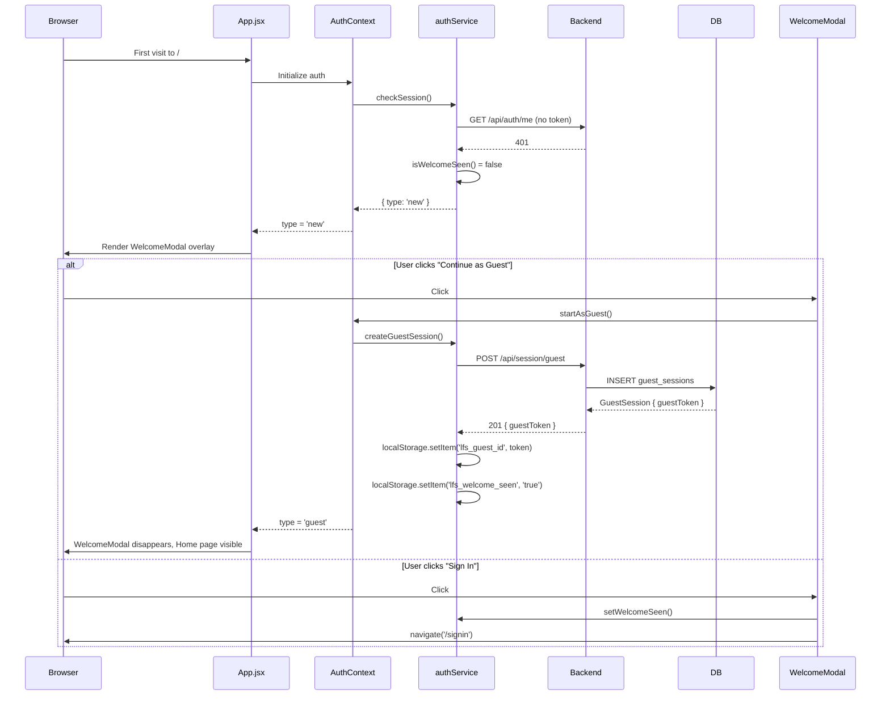
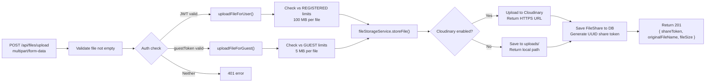
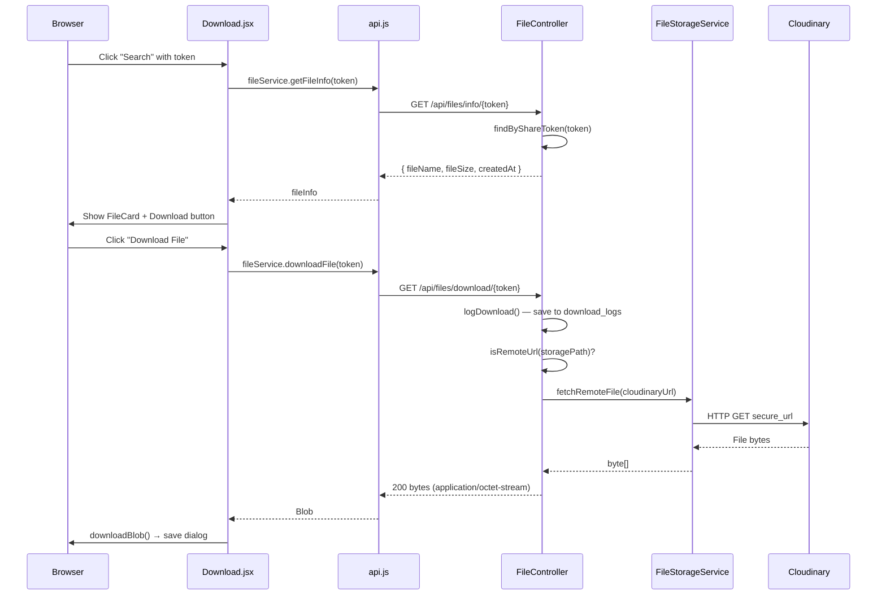
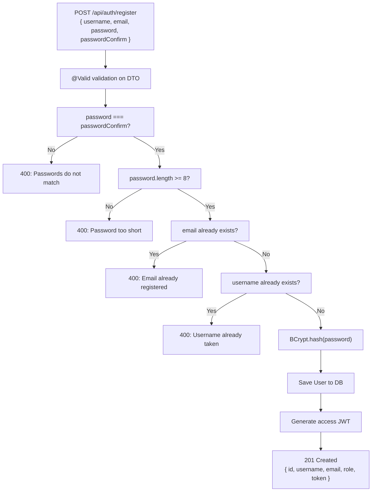
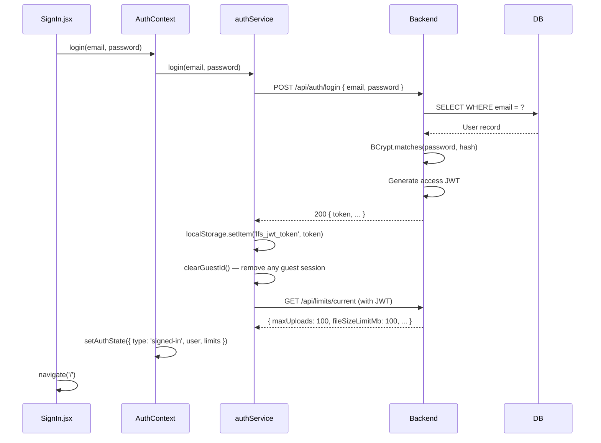

# LFS App — Feature Walkthroughs

> **Audience:** Developers who want to understand how each user-facing feature works end-to-end  
> **Format:** User flow → Backend flow → Database → Storage → Sequence diagram

---

## Feature 1: First-Time Visitor Onboarding (WelcomeModal)

### Purpose
When a brand-new user visits the app for the first time, we don't immediately ask them to create an account. Instead, a modal asks: "Continue as Guest" or "Sign In." This reduces friction and lets users experience the product before committing.

### User Flow
1. User visits `https://lfs-app.vercel.app` for the first time
2. The WelcomeModal overlay appears (full-screen, blocks content)
3. User sees two options: **Continue as Guest** or **Sign In / Create Account**
4. Guest path → session created, modal dismissed, user can upload immediately
5. Sign In path → redirected to `/signin`, modal dismissed after login

### Backend Flow

**Guest path:**
- Frontend calls `POST /api/session/guest`
- Backend creates a `GuestSession` row in DB with a UUID token and 30-day expiry
- Token returned to frontend, stored in `localStorage` as `lfs_guest_id`
- `lfs_welcome_seen=true` also saved in `localStorage`

**Sign In path:**
- `lfs_welcome_seen=true` saved immediately (before even logging in)
- User is redirected to `/signin`
- On successful login, `lfs_guest_id` is cleared, JWT stored

### Database Interactions

```sql
-- Guest path
INSERT INTO guest_sessions (guest_token, created_at, last_active_at, expires_at)
VALUES ('uuid-xxx', now(), now(), now() + interval '30 days');
```

### Sequence Diagram



---

## Feature 2: File Upload

### Purpose
The core feature — users select a file, click Upload, and receive a unique share token. The token is displayed with copy-to-clipboard functionality.

### User Flow
1. Navigate to `/upload`
2. Drag and drop a file onto the upload zone (or click to browse)
3. The file name and size appear as a preview
4. Click "Upload File"
5. Loading spinner shown during upload
6. On success: `TokenDisplay` component shows the share token and direct URL
7. User copies the token or URL to share with recipients

### Backend Flow



### Database Interactions

```sql
-- Check limits
SELECT * FROM user_limits WHERE user_type = 'GUEST';

-- Save file record
INSERT INTO file_shares (
    original_file_name, storage_path, share_token, 
    file_size_bytes, guest_session_id, created_at, updated_at
) VALUES (
    'document.pdf',
    'https://res.cloudinary.com/dtdefqg2q/raw/upload/v123/lfs-app/uploads/abc.pdf',
    'f47ac10b-58cc-4372-a567-0e02b2c3d479',
    102400,  -- 100 KB in bytes
    42,      -- guest_session.id
    now(), now()
);
```

### Storage Interactions

Cloudinary receives the raw file bytes:
```java
cloudinary.uploader().upload(
    file.getBytes(),
    ObjectUtils.asMap("folder", "lfs-app/uploads", "resource_type", "auto")
);
```

The `secure_url` from the response (e.g., `https://res.cloudinary.com/...`) is stored as the `storage_path`.

---

## Feature 3: File Download

### Purpose
Anyone who has a share token (or the direct URL) can download the file without an account.

### User Flow
1. Navigate to `/download`
2. Enter the share token in the input field (or paste the full URL — smart extraction handles it)
3. Click "Search" (or press Enter)
4. File info card appears: filename, upload date, file size
5. Click "Download File"
6. Browser save dialog opens

**Alternative entry point:** Navigate directly to `/download/{token}` — file info loads automatically.

### Backend Flow

**Search (getFileInfo):**
```
GET /api/files/info/{token}
→ 200 { shareToken, originalFileName, fileSize, createdAt }
→ 404 if token not found
```

**Download:**
```
GET /api/files/download/{token}[?guestToken=xxx]
→ Log the download event
→ Fetch file bytes (Cloudinary proxy or local disk)
→ Return bytes with Content-Disposition: attachment
```

### Database Interactions

```sql
-- Find file by token (info and download)
SELECT * FROM file_shares WHERE share_token = 'f47ac10b-...';

-- Log the download
INSERT INTO download_logs (
    file_id, downloader_type, downloader_id,
    timestamp, ip_address, user_agent
) VALUES (
    123,          -- file_shares.id
    'ANONYMOUS',  -- or USER or GUEST
    NULL,         -- null for anonymous
    now(),
    '1.2.3.4',
    'Mozilla/5.0 ...'
);
```

### Sequence Diagram



---

## Feature 4: User Registration

### Purpose
Users can create an account to unlock higher limits (100 MB per file, 10 GB total) and theoretically persist their files under a named account.

### User Flow
1. Click "Get Started" in Navbar (for `type='new'`) or "Sign In" (for guest) → navigate to `/signin`
2. Click "Create an account" link → navigate to `/register`
3. Fill in: Username, Email, Password, Confirm Password
4. Click "Create Account"
5. On success: logged in immediately (no email verification step)

### Backend Flow



### Database Interactions

```sql
-- Check uniqueness
SELECT id FROM app_users WHERE email = 'user@example.com';
SELECT id FROM app_users WHERE username = 'newuser';

-- Create user
INSERT INTO app_users (username, email, password_hash, role, created_at, updated_at)
VALUES ('newuser', 'user@example.com', '$2a$10$...bcrypt_hash...', 'ROLE_USER', now(), now());
```

---

## Feature 5: User Login

### Purpose
Allow existing users to authenticate and access their account.

### User Flow
1. Navigate to `/signin`
2. Enter Email and Password
3. Click "Sign In"
4. On success: redirected to `/`, Navbar shows username

### Sequence Diagram



---

## Feature 6: Logout

### Purpose
Clear the user's session and return to an unauthenticated state.

### User Flow
1. Click on username in Navbar → dropdown menu opens
2. Click "Sign Out"
3. Redirected to `/`
4. Navbar shows "Get Started" (type='new')

### Backend Flow

```
POST /api/auth/logout (requires JWT)
→ 200 { message: "Logged out successfully" }
```

Frontend additionally:
- Removes `lfs_jwt_token` from localStorage
- Removes `lfs_guest_id` from localStorage

---

## Feature 7: User Limits Display

### Purpose
Show users their current upload and storage limits so they understand what they can do.

### User Flow
- Visible on the Home page (only for `guest` and `signed-in` users — not for `new`)
- Shows: Max file size, Max uploads, Max storage, Max downloads
- Different values for guests vs registered users

### Backend Flow

```
GET /api/limits/current[?guestToken=xxx]
→ Checks: is authentication set? → use REGISTERED limits
→ Else: is guestToken valid? → use GUEST limits
→ Else: 401
→ Return { fileSizeLimitMb, maxUploads, maxStorageMb, maxDownloads, userType }
```

The frontend converts MB to bytes for comparison in Upload.jsx:
```javascript
maxFileSize: data.fileSizeLimitMb * 1024 * 1024   // MB → bytes
maxStorageBytes: data.maxStorageMb * 1024 * 1024   // MB → bytes
```

---

## Feature 8: Token-Based Share URL

### Purpose
After upload, users get a direct URL they can share. The recipient can paste this URL into the Download page's token field, or open the URL directly.

### How It Works

**TokenDisplay.jsx** constructs the URL:
```javascript
const shareUrl = `${window.location.origin}/download/${token}`;
// e.g., https://lfs-app.vercel.app/download/f47ac10b-58cc-4372-a567-0e02b2c3d479
```

**Download.jsx** handles incoming URLs via smart extraction:
```javascript
const extractToken = (input) => {
    if (input.includes('/download/')) {
        const parts = input.split('/download/');
        return parts[parts.length - 1].split('?')[0].trim();
    }
    return input.trim();  // Already a raw token
};
```

This means a user can paste either:
- Raw token: `f47ac10b-58cc-4372-a567-0e02b2c3d479`
- Full URL: `https://lfs-app.vercel.app/download/f47ac10b-58cc-4372-a567-0e02b2c3d479`

Both work correctly.

**React Router URL parameter:** Navigating directly to `/download/f47ac10b-...` also works:
```jsx
// App.jsx
<Route path="/download/:token" element={<Download />} />

// Download.jsx
const { token: urlToken } = useParams();
useEffect(() => {
    if (urlToken) handleFetch(urlToken);  // Auto-search on mount
}, [urlToken]);
```
