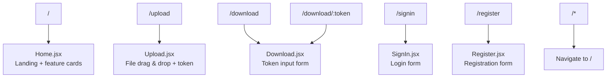
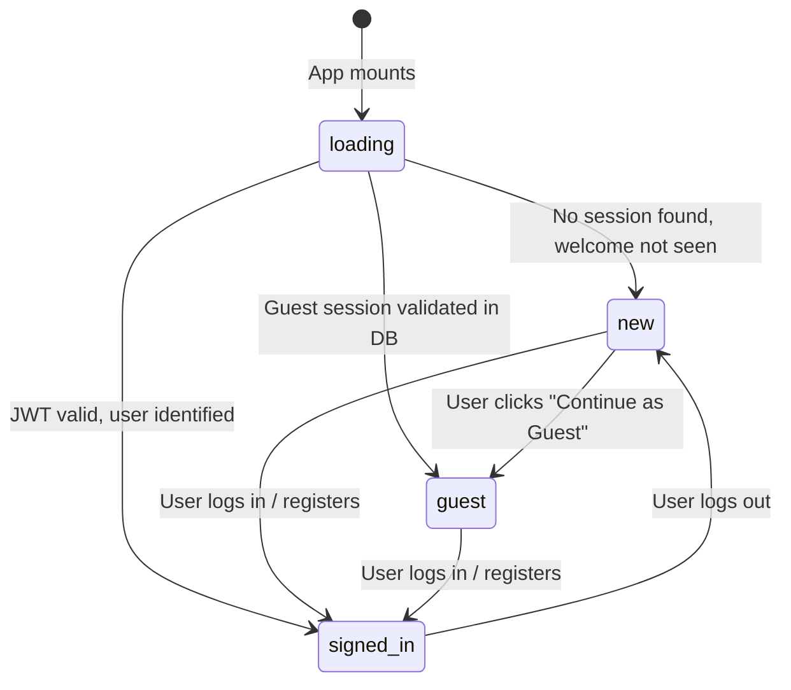
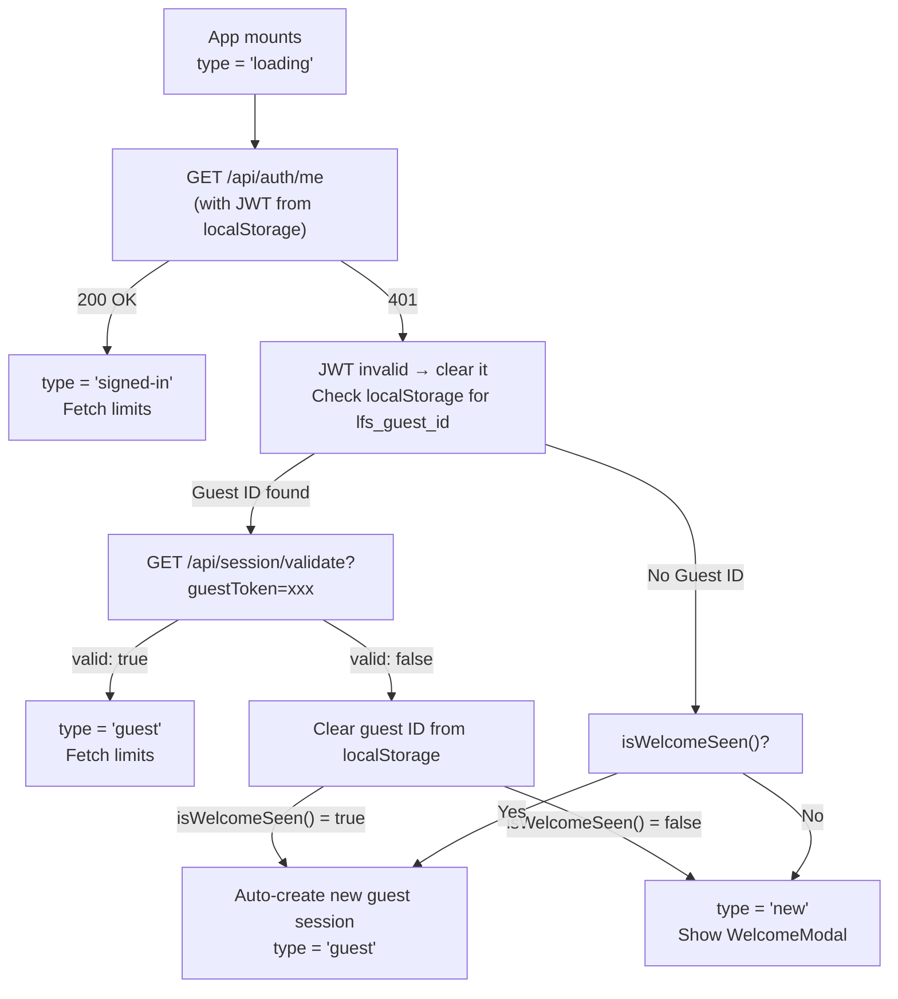
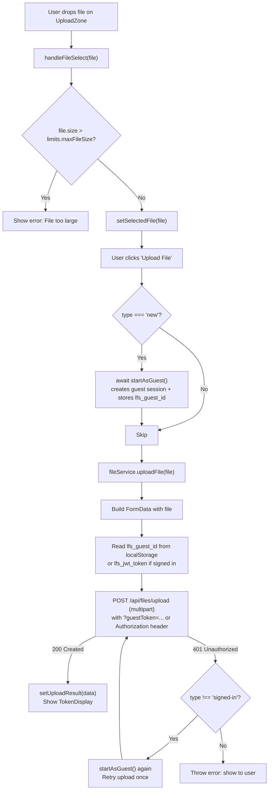
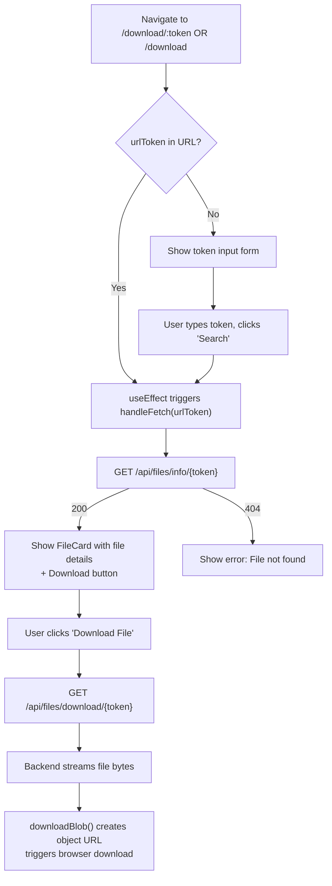
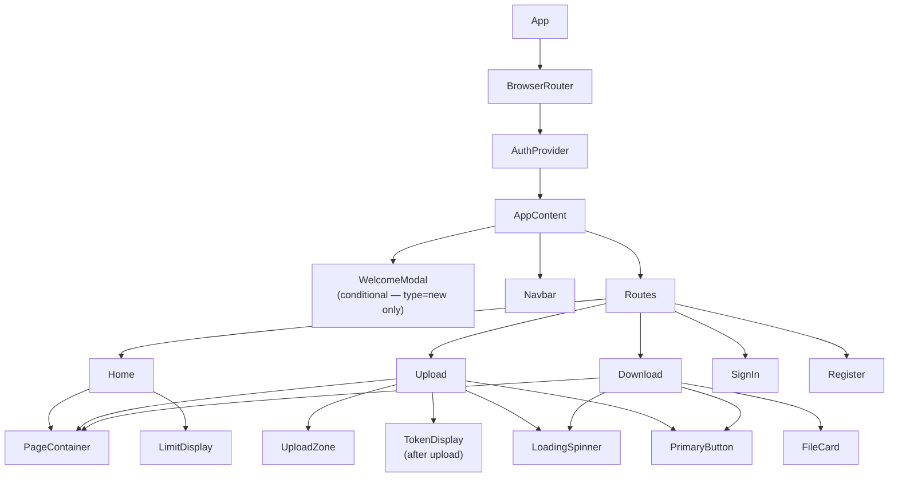

# LFS App — Frontend Flow

> **Audience:** Developers new to the React frontend  
> **Goal:** Understand how the React app is structured, how state flows, how pages work, and how the app communicates with the backend.

---

## 1. Application Entry Point

The app boots from two files:

**[`frontend/src/main.jsx`](../frontend/src/main.jsx)** — The very first file executed:
```jsx
import { StrictMode } from 'react'
import { createRoot } from 'react-dom/client'
import { injectSpeedInsights } from '@vercel/speed-insights'
import App from './App.jsx'

injectSpeedInsights() // Vercel performance monitoring

createRoot(document.getElementById('root')).render(
  <StrictMode>
    <App />
  </StrictMode>
)
```

> **Why StrictMode?** It causes React to double-invoke certain lifecycle methods in development, catching side effects and bugs early. It has no effect in production.

**[`frontend/src/App.jsx`](../frontend/src/App.jsx)** — Sets up the provider tree and routes:
```jsx
export default function App() {
  return (
    <BrowserRouter>
      <AuthProvider>   {/* Global auth state available everywhere */}
        <AppContent /> {/* Routes + WelcomeModal */}
        <Analytics />  {/* Vercel Analytics */}
      </AuthProvider>
    </BrowserRouter>
  );
}
```

---

## 2. Routing Flow

All routes are defined in `AppContent` inside `App.jsx`:



**Important notes:**
- `/download/:token` and `/download` share the same component (`Download.jsx`). When a token is in the URL, the page auto-fetches file info on mount.
- There are **no protected routes** via React Router. Any user can navigate to any page. The access control is on the backend (upload requires valid session).
- `vercel.json` contains a catch-all rewrite rule: all URLs serve `index.html`. This enables client-side routing on Vercel.

---

## 3. State Management Approach

**The project uses React Context (no Redux, no Zustand).** The auth state is global and centralized; all other state is local within components.

### Auth State Machine

The auth state has four possible values (`type`):



| State | Meaning | Navbar shows | WelcomeModal shows |
|---|---|---|---|
| `loading` | Auth check in progress | "Loading..." | No |
| `new` | No session; first visit | "Get Started" | Yes (if not on auth route) |
| `guest` | Has guest session | "👤 Guest" + "Sign In" | No |
| `signed-in` | JWT authenticated | Username + menu | No |

### AuthContext Shape

```javascript
// What every component can access via useAuth():
{
  type: 'loading' | 'new' | 'guest' | 'signed-in',
  user: null | { id, username, email, role },
  guestId: null | "uuid-string",
  limits: null | { maxFileSize, maxFiles, maxStorageBytes, maxDownloads, userType },
  error: null | "error message",
  
  // Actions:
  startAsGuest: async () => void,
  login: async (email, password) => { success, error },
  register: async (username, email, password, passwordConfirm) => { success, error },
  logout: async () => void,
  clearError: () => void
}
```

---

## 4. Authentication Flow

### 4a. Initialization on App Mount

When the app first loads, `AuthContext` runs `checkSession()`:



> **Why auto-create a guest session if welcome is already seen?** If a returning visitor's guest session expired (they last visited >30 days ago), we don't want to show them the WelcomeModal again. Instead, we silently create a new guest session so their upload works without friction. This avoids 401 errors for returning users.

### 4b. localStorage Keys

The frontend stores two keys in `localStorage`:

| Key | Value | Purpose |
|---|---|---|
| `lfs_guest_id` | UUID string (the guest token) | Identifies the guest session; sent as `?guestToken=` query param |
| `lfs_welcome_seen` | `"true"` | Prevents showing WelcomeModal on return visits |
| `lfs_jwt_token` | JWT string | Sent as `Authorization: Bearer` header for authenticated requests |

### 4c. Login / Registration Flow

```mermaid
sequenceDiagram
    participant SignIn.jsx
    participant AuthContext
    participant authService
    participant Backend

    SignIn.jsx->>AuthContext: login(email, password)
    AuthContext->>authService: login(email, password)
    authService->>Backend: POST /api/auth/login { email, password }
    Backend-->>authService: 200 { id, username, email, role, token, refreshToken }\n+ Set-Cookie: LFS_AUTH=...; LFS_REFRESH=...
    authService->>authService: localStorage.setItem('lfs_jwt_token', token)
    authService->>authService: clearGuestId()
    authService-->>AuthContext: { success: true, user: {...} }
    AuthContext->>Backend: GET /api/limits/current (with JWT)
    Backend-->>AuthContext: { maxUploads: 100, fileSizeLimitMb: 100, ... }
    AuthContext->>AuthContext: setAuthState({ type: 'signed-in', user, limits })
    AuthContext-->>SignIn.jsx: { success: true }
    SignIn.jsx->>SignIn.jsx: navigate('/')
```

> **Dual token strategy:** The backend issues both a JWT and sets an `httpOnly` cookie (`LFS_AUTH`). The frontend uses the JWT in `Authorization` headers. The cookie is a backup — `JwtAuthenticationFilter` checks both. This handles scenarios where the cookie is available but the localStorage token isn't (e.g., browser cleared storage).

---

## 5. File Upload Process



Key files involved:
- [`Upload.jsx`](../frontend/src/pages/Upload.jsx) — orchestrates the upload UI
- [`UploadZone.jsx`](../frontend/src/components/UploadZone.jsx) — drag-and-drop UI
- [`api.js`](../frontend/src/services/api.js) — `fileService.uploadFile()` function
- [`TokenDisplay.jsx`](../frontend/src/components/TokenDisplay.jsx) — shows result with copy buttons

---

## 6. File Download Process

The download page supports two entry points:

**Entry 1:** User manually enters a token at `/download`  
**Entry 2:** Someone shares a direct URL like `https://app.com/download/abc-123-uuid`



**Smart token extraction:** The `extractToken()` function accepts both raw tokens (`abc-123`) and full URLs (`https://app.com/download/abc-123`). It parses out the token part, making it user-friendly to paste either format.

---

## 7. Component Hierarchy



---

## 8. API Communication Pattern

All API calls follow this pattern in `authService.js` and `api.js`:

```javascript
// Pattern 1: Auth-aware request (includes JWT if available)
const headers = {};
const token = localStorage.getItem('lfs_jwt_token');
if (token) {
  headers['Authorization'] = `Bearer ${token}`;
}
const response = await fetch(url, {
  method: 'POST',
  headers,
  credentials: 'include',  // Always included so cookies are sent
  body: JSON.stringify(data)
});

// Pattern 2: Guest-aware URL construction
const guestId = localStorage.getItem('lfs_guest_id');
const url = guestId
  ? `${API_BASE}/files/upload?guestToken=${encodeURIComponent(guestId)}`
  : `${API_BASE}/files/upload`;
```

> **Why `credentials: 'include'` everywhere?** The backend sets httpOnly cookies (`LFS_AUTH`, `LFS_REFRESH`) on login. `credentials: 'include'` tells the browser to send these cookies on subsequent requests. Without it, cross-domain cookies are blocked.

---

## 9. Common Frontend Patterns

### Pattern 1: Auth-Gated UI (type checking)
```jsx
// Show different UI based on auth state
const { type } = useAuth();

{type === 'loading' && <LoadingSpinner />}
{type === 'guest' && <GuestBanner />}
{type === 'signed-in' && <UserDashboard />}
```

### Pattern 2: Optimistic Loading State
```jsx
const [isLoading, setIsLoading] = useState(false);

const handleAction = async () => {
  setIsLoading(true);
  try {
    await someAsyncOperation();
  } catch (err) {
    setError(err.message);
  } finally {
    setIsLoading(false);  // Always reset, even on error
  }
};
```

### Pattern 3: Conditional Page Render (result vs form)
```jsx
// Upload.jsx — after upload, show result instead of form
if (uploadResult) {
  return <TokenDisplay token={uploadResult.shareToken} />;
}
return <UploadForm ... />;
```

### Pattern 4: useCallback for Stable Context Functions
```jsx
// AuthContext.jsx — prevents unnecessary re-renders
const login = useCallback(async (email, password) => {
  // ...
}, []);  // Empty deps = function reference is stable
```

### Pattern 5: CSS Co-location
Every component has its own `.css` file next to it:
```
Navbar.jsx
Navbar.css   ← styles for Navbar only
```
This avoids global CSS conflicts and makes components portable.

---

## 10. Environment Configuration

```javascript
// api.js and authService.js both read this:
const API_BASE = import.meta.env.VITE_API_BASE_URL || 'http://localhost:8080/api';
```

In development, set `VITE_API_BASE_URL=http://localhost:8080/api` in `frontend/.env`.  
In production, set it to `https://lfs-app.onrender.com/api`.

Vite also provides a dev server proxy (in `vite.config.js`) as an alternative for local development:
```javascript
server: {
  proxy: {
    '/api': {
      target: 'http://localhost:8080',
      changeOrigin: true,
    }
  }
}
```
This means you can also use `/api` as a relative URL in development and Vite will forward it to the backend.
