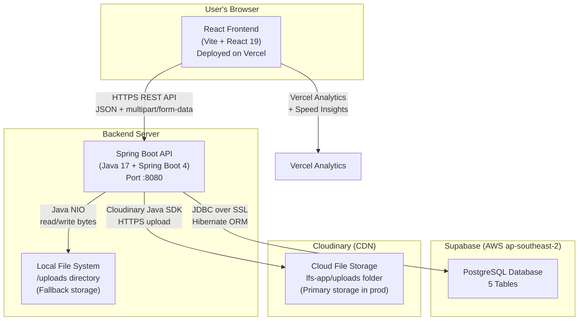
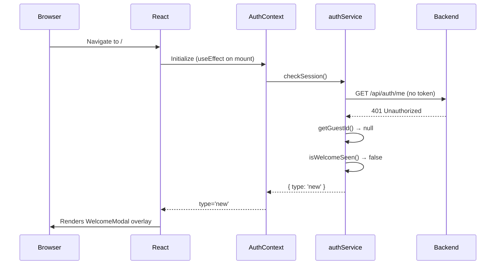
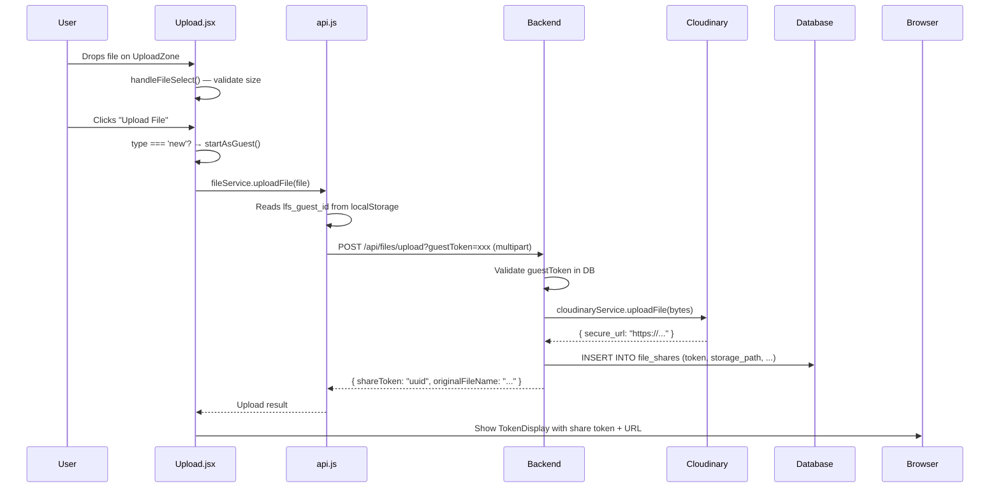
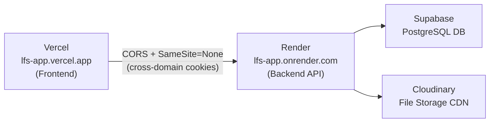

# LFS App — Project Architecture

> **Reading time:** ~15 minutes  
> **Audience:** New contributors inheriting this project  
> **Goal:** Give you a complete mental model of how the system works before you touch a single line of code.

---

## 1. What Is This Project?

**LFS (Lightweight File Sharing)** is a token-based file sharing web application. Users can:
- Upload a file and receive a unique **share token**
- Share that token (or a direct URL) with anyone
- The recipient enters the token and downloads the file — no account needed

The core value proposition: **zero-friction file sharing**. No email address required, no account to create. Guests can start uploading within seconds.

---

## 2. High-Level Architecture



**Request flow in one sentence:** The React frontend sends REST API calls to the Spring Boot backend on Render. The backend authenticates the request, stores files in Cloudinary (or local disk as fallback), records metadata in Supabase PostgreSQL, and returns a share token to the user.

---

## 3. Technology Choices — The "Why"

| Technology | Role | Why It Was Chosen |
|---|---|---|
| **React 19** | Frontend UI | Industry standard for SPA development; hooks-based state is clean and testable |
| **Vite 8** | Frontend build tool | Extremely fast HMR (Hot Module Replacement) vs Create React App; native ESM support |
| **React Router v6** | Client-side routing | Declarative route definitions; supports URL params for token-based download links |
| **Spring Boot 4** | Backend REST API | Java ecosystem maturity; auto-configuration reduces boilerplate; excellent security support |
| **Spring Security** | Auth/CORS/headers | Battle-tested security framework with JWT filter chain support |
| **PostgreSQL (Supabase)** | Database | Relational model fits file metadata well; Supabase provides free managed Postgres with connection pooling |
| **Cloudinary** | File storage (prod) | Globally distributed CDN; free tier generous; `resource_type: auto` handles any file type |
| **Local filesystem** | File storage (dev) | Zero-config local fallback for development; no Cloudinary keys needed |
| **JWT (JJWT 0.11.5)** | Authentication tokens | Stateless; works well for cross-domain deployments (Vercel ↔ Render) |
| **BCrypt** | Password hashing | Industry standard; adaptive cost factor prevents brute-force attacks |
| **Docker** | Backend containerization | Reproducible build environment for Render deployment |
| **Vercel** | Frontend hosting | Zero-config React/Vite deployment; automatic HTTPS; generous free tier |
| **Render** | Backend hosting | Docker-based deployment; free tier available; environment variable management |

---

## 4. Major Modules and Responsibilities

### Frontend Modules

```
frontend/src/
├── main.jsx          → App entry point; mounts React, injects Vercel Speed Insights
├── App.jsx           → Root component; sets up Router, AuthProvider, WelcomeModal logic
├── context/
│   └── AuthContext.jsx  → Global auth state machine (loading → new → guest → signed-in)
├── hooks/
│   └── useAuth.js    → Thin wrapper to consume AuthContext safely
├── services/
│   ├── authService.js   → All auth API calls + localStorage management (guest ID, JWT)
│   └── api.js           → File upload/download/info API calls
├── pages/
│   ├── Home.jsx         → Landing page with Upload/Download cards
│   ├── Upload.jsx       → File upload page (drag & drop)
│   ├── Download.jsx     → Token lookup and file download page
│   ├── SignIn.jsx        → Login form
│   └── Register.jsx     → Registration form
└── components/
    ├── Navbar.jsx        → Top navigation; auth-aware (shows guest/user/login state)
    ├── WelcomeModal.jsx  → First-visit modal; choose guest or sign in
    ├── TokenDisplay.jsx  → Shows share token + URL after upload; copy-to-clipboard
    ├── UploadZone.jsx    → Drag-and-drop file zone
    ├── FileCard.jsx      → Displays file info (name, size, date) before download
    ├── LimitDisplay.jsx  → Shows upload/download limits for current user type
    ├── LoadingSpinner.jsx → Reusable spinner
    ├── PrimaryButton.jsx  → Styled button with disabled state
    └── PageContainer.jsx  → Layout wrapper with consistent padding
```

### Backend Modules

```
backend/src/main/java/com/lfs/backend/
├── BackendApplication.java   → Entry point; loads .env file, starts Spring
├── config/
│   ├── SecurityConfig.java        → Spring Security: CORS, JWT filter, endpoint permissions
│   └── ApplicationStartup.java    → Runs on boot: initializes default user limits in DB
├── controller/
│   ├── AuthController.java        → POST /api/auth/register|login|logout; GET /me|verify
│   ├── FileController.java        → POST /api/files/upload; GET /info/{token}|download/{token}
│   ├── SessionController.java     → POST /api/session/guest; GET /current|validate
│   └── LimitsController.java      → GET /api/limits/current
├── service/
│   ├── AuthService.java           → Business logic: register, login, guest sessions, JWT
│   ├── FileStorageService.java    → Storage abstraction: Cloudinary or local filesystem
│   ├── CloudinaryService.java     → Cloudinary SDK wrapper (upload, delete)
│   └── LimitService.java          → Upload/download limits per user type
├── entity/
│   ├── User.java                  → Registered user (@Entity, table: app_users)
│   ├── FileShare.java             → Uploaded file record + share token
│   ├── GuestSession.java          → Anonymous session with 30-day expiry
│   ├── DownloadLog.java           → Download event audit trail
│   └── UserLimits.java            → Per-tier limits (guest vs registered)
├── repository/                    → Spring Data JPA interfaces (auto-implemented)
├── dto/                           → Request/Response data transfer objects
└── util/
    ├── JwtTokenProvider.java       → JWT generation, validation, claim extraction
    └── JwtAuthenticationFilter.java → HTTP filter: extracts JWT from header or cookie
```

---

## 5. Request Lifecycle Overview

### A. First-Time Visitor Visiting `/`



### B. File Upload (Guest User)



---

## 6. Cross-Domain Deployment Architecture

This is an important detail. The frontend is on **Vercel** (e.g., `https://lfs-app.vercel.app`) and the backend is on **Render** (e.g., `https://lfs-app.onrender.com`). These are different domains.



Key cross-domain settings required:
- **CORS:** Backend allows `frontendUrl` origin (set via `FRONTEND_URL` env var)
- **Cookies:** `SameSite=None; Secure` so the `LFS_AUTH` cookie works cross-domain over HTTPS
- **VITE_API_BASE_URL:** Frontend must point to the Render URL (not localhost) in production

---

## 7. Data Flow Summary

```
User Action
    ↓
React Component (pages/)
    ↓
Service Layer (services/authService.js or api.js)
    ↓
HTTP Request (fetch API)
    ↓
JwtAuthenticationFilter (extracts token from header or cookie)
    ↓
Spring Security (checks endpoint permissions)
    ↓
Controller (@RestController)
    ↓
Service (@Service — business logic)
    ↓
Repository (Spring Data JPA)
    ↓
PostgreSQL (Supabase)
    
    (For file uploads, also:)
    ↓
FileStorageService
    ↓
CloudinaryService → Cloudinary CDN
    (or local /uploads directory if Cloudinary not configured)
```

---

## 8. Security Boundary Overview

| Layer | Mechanism |
|---|---|
| Transport | HTTPS enforced (Vercel, Render, Supabase all HTTPS) |
| Authentication | JWT in `Authorization: Bearer` header or `LFS_AUTH` httpOnly cookie |
| Guest identity | UUID token stored in client localStorage, validated against DB on each request |
| Password storage | BCrypt hashed; plain text never stored |
| CORS | Allowlist-based; only configured frontend URL allowed |
| Security headers | CSP, HSTS, X-Frame-Options, X-Content-Type-Options set in SecurityConfig |
| Database | SSL required on Supabase connection (`sslmode=require`) |

---

## 9. Development vs Production Differences

| Aspect | Development | Production |
|---|---|---|
| File storage | Local `/uploads` directory | Cloudinary CDN |
| Auth cookies | No `Secure` flag (allows HTTP) | `Secure; SameSite=None` (HTTPS required) |
| API URL | `http://localhost:8080` via Vite proxy | `https://lfs-app.onrender.com` via env var |
| DB | Same Supabase (shared) | Same Supabase |
| ENV loading | `.env` file read by `BackendApplication.java` | Environment variables set on Render dashboard |
| CORS origins | Includes `localhost:5173, localhost:3000` | Set to production frontend URL only |
