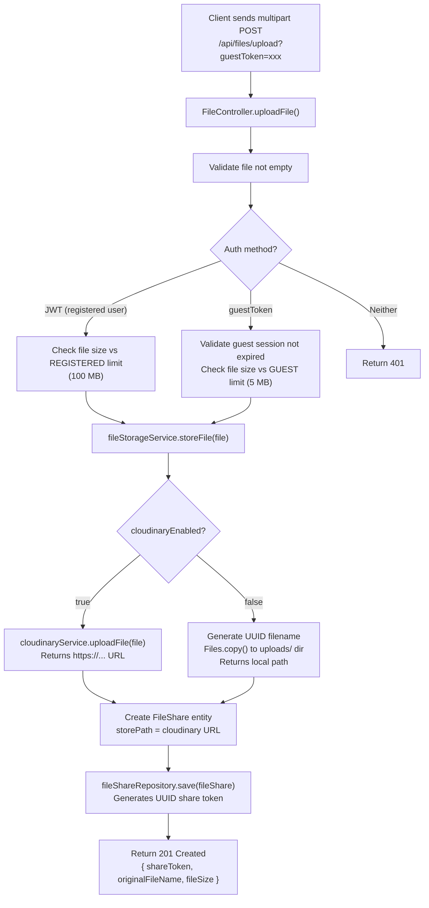
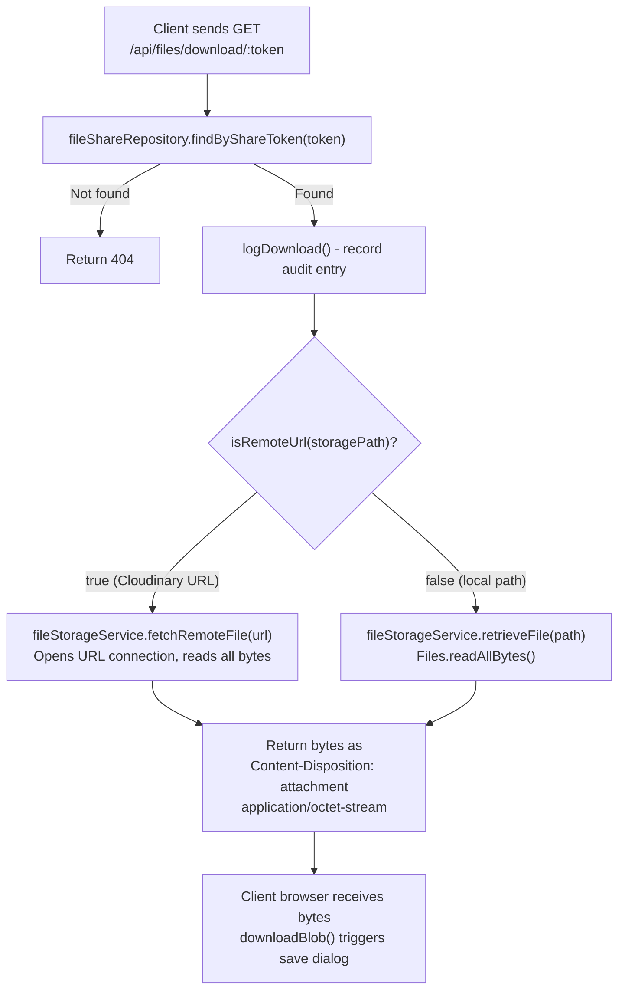

# LFS App — Storage System

> **Audience:** Developers who need to understand or extend how files are stored and retrieved  
> **Key insight:** The storage system has a clean abstraction — all callers interact with `FileStorageService`, which transparently handles either Cloudinary or the local filesystem.

---

## 1. Overview: Dual Storage Strategy

The system supports two storage backends:

| Backend | When Used | How Files Are Served |
|---|---|---|
| **Cloudinary** | Production (when `CLOUDINARY_*` env vars are set) | Backend proxies the file from Cloudinary to the client |
| **Local Filesystem** | Development fallback (no Cloudinary config) | Backend reads from `uploads/` directory |

The choice of backend is made **once at startup** in `FileStorageService`:

```java
// FileStorageService.java constructor
this.cloudinaryEnabled = cloudinaryService != null 
    && cloudinaryService.isConfigured() 
    && cloudinaryApiKey != null 
    && !cloudinaryApiKey.isEmpty();
```

After startup, `cloudinaryEnabled` is a simple boolean that gates every upload decision.

---

## 2. Local Storage Implementation

### How It Works

When Cloudinary is not configured, files are stored in the `uploads/` directory relative to where the backend process runs.

```java
// FileStorageService.java - local path
public String storeFile(MultipartFile file) throws IOException {
    String fileName = generateUniqueFileName(file.getOriginalFilename());
    Path uploadPath = Paths.get(UPLOAD_DIR);  // "uploads"
    Path filePath = uploadPath.resolve(fileName);
    
    Files.copy(file.getInputStream(), filePath);
    
    return filePath.toString();  // e.g., "uploads/a3f2b1c0-uuid.pdf"
}

private String generateUniqueFileName(String originalFileName) {
    // UUID prefix prevents collisions, extension preserved for MIME type hints
    return UUID.randomUUID() + extractExtension(originalFileName);
}
```

The `uploads/` directory is created on startup if it doesn't exist:
```java
Path uploadPath = Paths.get(UPLOAD_DIR);
if (!Files.exists(uploadPath)) {
    Files.createDirectories(uploadPath);
}
```

### File Retrieval (Local)
```java
public byte[] retrieveFile(String storagePath) throws IOException {
    Path filePath = Paths.get(storagePath);
    if (!Files.exists(filePath)) {
        throw new IllegalArgumentException("File not found: " + storagePath);
    }
    return Files.readAllBytes(filePath);
}
```

> **Warning:** `Files.readAllBytes()` loads the entire file into memory. For large files (100 MB), this could cause `OutOfMemoryError`. A better approach for production would be to stream the file using `Files.newInputStream()`. This is the primary reason large file support needs Cloudinary.

### Docker Consideration

In the Docker setup (for Render), the `uploads/` directory is created inside the container:
```dockerfile
RUN mkdir -p uploads && chown -R spring:spring uploads
```

**Critical limitation:** The container filesystem is **ephemeral**. If Render restarts the container, all locally stored files are lost. This is why Cloudinary is required in production — files persisted to Cloudinary survive container restarts.

---

## 3. Cloudinary Integration

### Setup

[`CloudinaryService.java`](../backend/src/main/java/com/lfs/backend/service/CloudinaryService.java) wraps the Cloudinary Java SDK:

```java
public CloudinaryService(
    @Value("${cloudinary.cloud-name:}") String cloudName,
    @Value("${cloudinary.api-key:}") String apiKey,
    @Value("${cloudinary.api-secret:}") String apiSecret,
    @Value("${cloudinary.upload-folder:lfs-app/uploads}") String uploadFolder
) {
    // If any credential is missing, cloudinary = null (not configured)
    if (cloudName == null || cloudName.isEmpty() || apiKey == null...) {
        this.cloudinary = null;
    } else {
        this.cloudinary = new Cloudinary(ObjectUtils.asMap(
            "cloud_name", cloudName,
            "api_key", apiKey,
            "api_secret", apiSecret
        ));
    }
}
```

The `isConfigured()` method simply checks `return this.cloudinary != null`.

### File Upload to Cloudinary

```java
public String uploadFile(MultipartFile file) throws IOException {
    Map<?, ?> result = cloudinary.uploader().upload(
        file.getBytes(),               // Full file as byte array
        ObjectUtils.asMap(
            "folder", uploadFolder,    // e.g., "lfs-app/uploads"
            "resource_type", "auto"    // Auto-detects: image, video, raw, etc.
        )
    );
    
    // Cloudinary returns a JSON response; we want the CDN URL
    Object secureUrl = result.get("secure_url");
    // Returns: "https://res.cloudinary.com/dtdefqg2q/raw/upload/v123.../lfs-app/uploads/abc123"
    return secureUrl.toString();
}
```

**`resource_type: "auto"` is critical** — without this, Cloudinary defaults to `image` type and rejects non-image files (PDFs, ZIPs, etc.).

The returned `secure_url` is stored in `file_shares.storage_path`. This URL is what distinguishes "stored remotely" from "stored locally":

```java
// FileStorageService.java
public boolean isRemoteUrl(String storagePath) {
    return storagePath != null 
        && (storagePath.startsWith("http://") || storagePath.startsWith("https://"));
}
```

### Required Cloudinary Environment Variables

```bash
CLOUDINARY_CLOUD_NAME=your_cloud_name      # From Cloudinary dashboard
CLOUDINARY_API_KEY=your_api_key            # From Cloudinary dashboard
CLOUDINARY_API_SECRET=your_api_secret      # From Cloudinary dashboard
CLOUDINARY_UPLOAD_FOLDER=lfs-app/uploads   # Folder in Cloudinary Media Library
```

Spring maps these via `application.properties` conventions:
- `CLOUDINARY_CLOUD_NAME` → `cloudinary.cloud-name`
- `CLOUDINARY_API_KEY` → `cloudinary.api-key`
- `CLOUDINARY_API_SECRET` → `cloudinary.api-secret`

(Spring Boot automatically converts `SCREAMING_SNAKE_CASE` env vars to `kebab-case` properties)

---

## 4. Upload Workflow



---

## 5. Download Workflow



### Client-Side Download Trigger

The frontend uses a pattern to trigger browser downloads from a byte response:

```javascript
// api.js
export const downloadBlob = (blob, fileName) => {
  const url = window.URL.createObjectURL(blob);  // Create temporary object URL
  const link = document.createElement('a');
  link.href = url;
  link.download = fileName;        // Suggests filename to browser
  document.body.appendChild(link);
  link.click();                    // Trigger download
  document.body.removeChild(link);
  window.URL.revokeObjectURL(url); // Clean up memory
};
```

---

## 6. Storage Abstraction Design

The key design principle is that **callers never know which storage backend is active**:

```
FileController
    ↓
fileStorageService.storeFile(file)    ← only method callers need to know
    ↓
    ├── (if cloudinaryEnabled) cloudinaryService.uploadFile(file) → returns URL
    └── (otherwise)            Files.copy() to local disk → returns path
```

This means:
1. Adding a new storage backend (S3, Azure Blob, etc.) only requires modifying `FileStorageService`
2. Controllers and other services don't need to change
3. The `storagePath` field transparently stores either type of reference

### Extension Point: Adding S3

To add AWS S3 as a third storage option:

1. Create `S3StorageService.java` with an `uploadFile(MultipartFile)` method
2. Add an `@Value("${s3.bucket:}")` check in `FileStorageService` constructor
3. Add `s3Enabled` boolean similar to `cloudinaryEnabled`
4. In `storeFile()`, add `else if (s3Enabled)` branch calling `s3StorageService.uploadFile()`
5. The returned S3 URL (also an `https://` URL) will be handled by `isRemoteUrl()` automatically

---

## 7. Advantages and Tradeoffs

### Local Filesystem Storage

| Advantage | Tradeoff |
|---|---|
| Zero configuration for development | Files lost on container restart |
| No external dependency | Not scalable (tied to one server) |
| No API costs | No CDN benefits |
| Fast local reads | Loads entire file into memory |

### Cloudinary

| Advantage | Tradeoff |
|---|---|
| Files persist across container restarts | Requires API credentials |
| Global CDN (fast downloads worldwide) | API costs at scale |
| `resource_type: auto` handles any file | CORS requires server-side proxy |
| Free tier: 25 GB storage, 25 GB bandwidth/month | Rate limits on free tier |
| Handles large files without memory issues | Backend must proxy the download (extra bandwidth) |

### Why The Backend Proxies Cloudinary Downloads

A direct approach would be to return the Cloudinary URL to the browser and let it download directly. This would be simpler and more efficient. However:

1. **CORS:** The browser would make a cross-origin request to `res.cloudinary.com` which could be blocked
2. **Content-Disposition:** We need to set `attachment; filename="..."` which requires controlling the response headers
3. **Future access control:** Proxying gives us a central point to add download limits, IP blocking, etc.

The current implementation fetches all bytes into memory and streams them. For very large files (the registered user limit is 100 MB), this is not ideal. A future improvement would use streaming via `InputStreamResource`.
